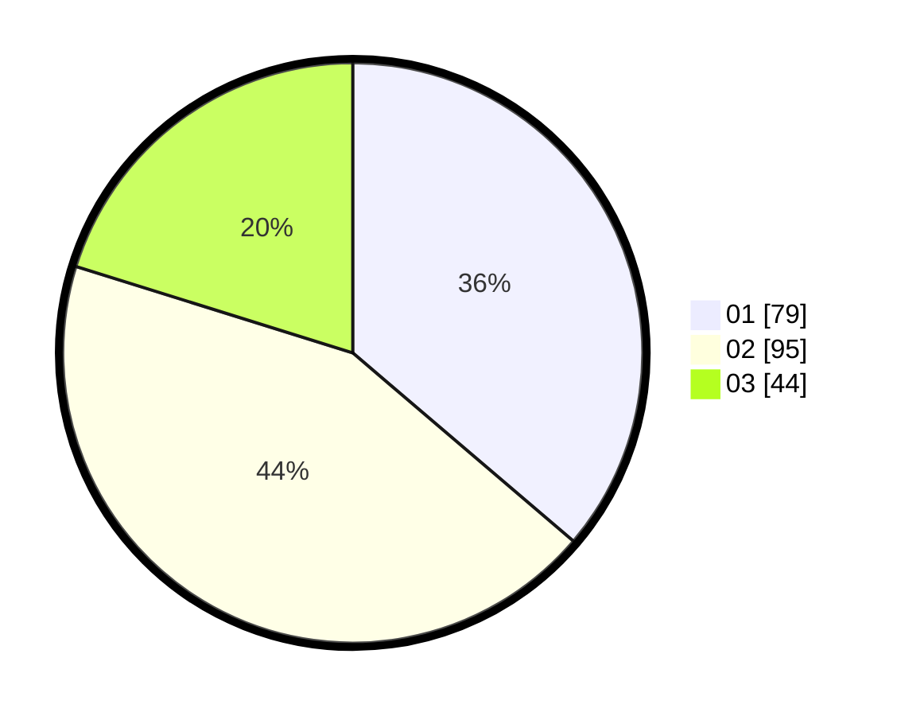

# Hasil

Hasil perolehan suara paslon dapat dilihat pada file paslon-01.txt, paslon-02.txt, dan paslon-03.txt.

Jika tidak ada, artinya data tersebut belum ada pada SIREKAP.

## Perolehan Suara

 * Paslon 01: **79**.
 * Paslon 02: **95**.
 * Paslon 03: **44**.

## Foto C Plano

https://sirekap-obj-formc.kpu.go.id/6fc6/pemilu/ppwp/31/75/04/10/02/3175041002075-20240219-142058--1fba6a41-01ca-495f-a4d8-76773cb0e5e0.jpg

https://sirekap-obj-formc.kpu.go.id/6fc6/pemilu/ppwp/31/75/04/10/02/3175041002075-20240215-205553--41159642-8228-4f04-8073-0a823a881f9a.jpg

https://sirekap-obj-formc.kpu.go.id/6fc6/pemilu/ppwp/31/75/04/10/02/3175041002075-20240215-205721--f63a182e-3398-450d-8141-89a7050d6b47.jpg
