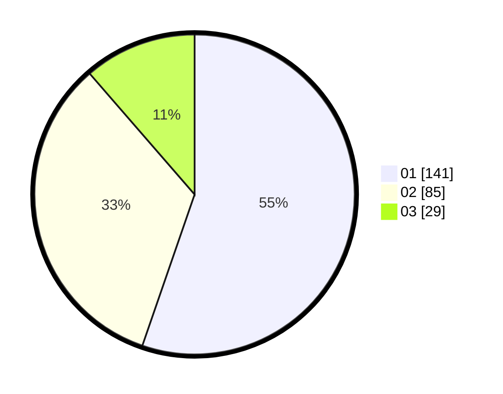

# Hasil

Hasil perolehan suara paslon dapat dilihat pada file paslon-01.txt, paslon-02.txt, dan paslon-03.txt.

Jika tidak ada, artinya data tersebut belum ada pada SIREKAP.

## Perolehan Suara

 * Paslon 01: **141**.
 * Paslon 02: **85**.
 * Paslon 03: **29**.

## Foto C Plano

https://sirekap-obj-formc.kpu.go.id/be21/pemilu/ppwp/31/75/04/10/02/3175041002076-20240216-183141--68e1fabb-a493-4aab-9fd4-eb73d02a44db.jpg

https://sirekap-obj-formc.kpu.go.id/be21/pemilu/ppwp/31/75/04/10/02/3175041002076-20240216-183315--76da699a-d4ba-4eb2-b9f8-afa3cd7c01ab.jpg

https://sirekap-obj-formc.kpu.go.id/be21/pemilu/ppwp/31/75/04/10/02/3175041002076-20240216-183424--c116ffc2-76bb-4660-a968-f7075d437470.jpg

## DATA PEMILIH TETAP

Jumlah pemilih dalam DPT: **290**.
 * L: **139**.
 * P: **151**.

## DATA PENGGUNA HAK PILIH

Jumlah pengguna hak pilih dalam DPT: **249**.
 * L: **115**.
 * P: **134**.

Jumlah pengguna hak pilih dalam DPTb: **4**.
 * L: **1**.
 * P: **3**.

Jumlah pengguna hak pilih dalam DPK: **5**.
 * L: **3**.
 * P: **2**.

Jumlah pengguna hak pilih: **258**.
 * L: **119**.
 * P: **139**.

## JUMLAH SUARA SAH DAN TIDAK SAH

JUMLAH SELURUH SUARA SAH: **255**.

JUMLAH SUARA TIDAK SAH: **3**.

JUMLAH SELURUH SUARA SAH DAN SUARA TIDAK SAH: **258**.
