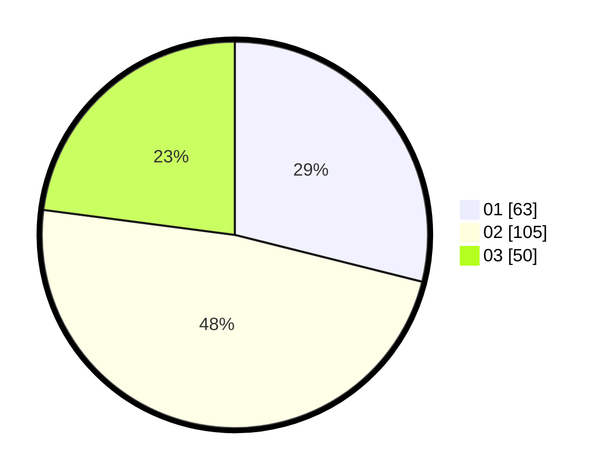

# Hasil

Hasil perolehan suara paslon dapat dilihat pada file paslon-01.txt, paslon-02.txt, dan paslon-03.txt.

Jika tidak ada, artinya data tersebut belum ada pada SIREKAP.

## Perolehan Suara

 * Paslon 01: **63**.
 * Paslon 02: **105**.
 * Paslon 03: **50**.

## Foto C Plano

https://sirekap-obj-formc.kpu.go.id/1565/pemilu/ppwp/31/75/04/10/02/3175041002080-20240217-155958--e7df3c74-9cdf-46da-b38f-daf5834e1324.jpg

https://sirekap-obj-formc.kpu.go.id/1565/pemilu/ppwp/31/75/04/10/02/3175041002080-20240219-124023--d9e3ece0-d703-4f61-8218-0b749b94aae5.jpg

https://sirekap-obj-formc.kpu.go.id/1565/pemilu/ppwp/31/75/04/10/02/3175041002080-20240217-160323--23abe9b0-c8d7-430d-b366-210a419b215f.jpg

## DATA PEMILIH TETAP

Jumlah pemilih dalam DPT: **265**.
 * L: **125**.
 * P: **140**.

## DATA PENGGUNA HAK PILIH

Jumlah pengguna hak pilih dalam DPT: **213**.
 * L: **100**.
 * P: **113**.

Jumlah pengguna hak pilih dalam DPTb: **0**.
 * L: **0**.
 * P: **0**.

Jumlah pengguna hak pilih dalam DPK: **7**.
 * L: **2**.
 * P: **5**.

Jumlah pengguna hak pilih: **220**.
 * L: **102**.
 * P: **118**.

## JUMLAH SUARA SAH DAN TIDAK SAH

JUMLAH SELURUH SUARA SAH: **218**.

JUMLAH SUARA TIDAK SAH: **2**.

JUMLAH SELURUH SUARA SAH DAN SUARA TIDAK SAH: **220**.
