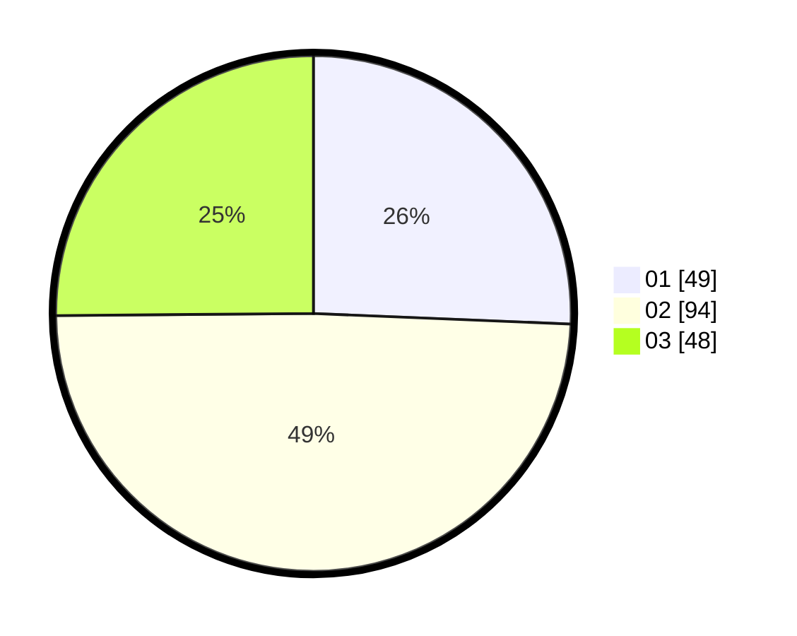

# Hasil

Hasil perolehan suara paslon dapat dilihat pada file paslon-01.txt, paslon-02.txt, dan paslon-03.txt.

Jika tidak ada, artinya data tersebut belum ada pada SIREKAP.

## Perolehan Suara

 * Paslon 01: **49**.
 * Paslon 02: **94**.
 * Paslon 03: **48**.

## Foto C Plano

https://sirekap-obj-formc.kpu.go.id/14fd/pemilu/ppwp/31/75/04/10/02/3175041002081-20240218-143059--90d79f74-94bb-44fc-b6db-746e8e186112.jpg

https://sirekap-obj-formc.kpu.go.id/14fd/pemilu/ppwp/31/75/04/10/02/3175041002081-20240218-143150--53ca4ca5-6b10-4749-b193-55fa2bfd3f2c.jpg

https://sirekap-obj-formc.kpu.go.id/14fd/pemilu/ppwp/31/75/04/10/02/3175041002081-20240218-143243--bdcb39ad-cedc-46a4-80a6-128f0d73e2a1.jpg

## DATA PEMILIH TETAP

Jumlah pemilih dalam DPT: **253**.
 * L: **107**.
 * P: **146**.

## DATA PENGGUNA HAK PILIH

Jumlah pengguna hak pilih dalam DPT: **197**.
 * L: **84**.
 * P: **113**.

Jumlah pengguna hak pilih dalam DPTb: **0**.
 * L: **0**.
 * P: **0**.

Jumlah pengguna hak pilih dalam DPK: **0**.
 * L: **0**.
 * P: **0**.

Jumlah pengguna hak pilih: **197**.
 * L: **84**.
 * P: **113**.

## JUMLAH SUARA SAH DAN TIDAK SAH

JUMLAH SELURUH SUARA SAH: **191**.

JUMLAH SUARA TIDAK SAH: **6**.

JUMLAH SELURUH SUARA SAH DAN SUARA TIDAK SAH: **197**.
