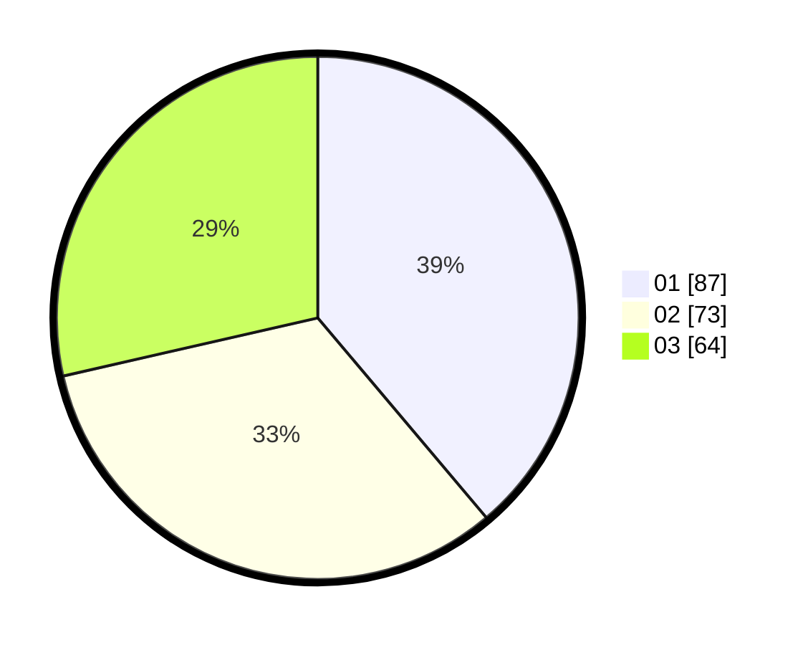

# Hasil

Hasil perolehan suara paslon dapat dilihat pada file paslon-01.txt, paslon-02.txt, dan paslon-03.txt.

Jika tidak ada, artinya data tersebut belum ada pada SIREKAP.

## Perolehan Suara

 * Paslon 01: **87**.
 * Paslon 02: **73**.
 * Paslon 03: **64**.

## Foto C Plano

https://sirekap-obj-formc.kpu.go.id/5a7f/pemilu/ppwp/31/75/04/10/02/3175041002082-20240217-232421--f14bf193-95a9-4d4d-b9f9-2cd9d08dd663.jpg

https://sirekap-obj-formc.kpu.go.id/5a7f/pemilu/ppwp/31/75/04/10/02/3175041002082-20240214-155220--dbb2d011-1bc1-4296-957f-9ba49e6b010d.jpg

https://sirekap-obj-formc.kpu.go.id/5a7f/pemilu/ppwp/31/75/04/10/02/3175041002082-20240214-155353--414afb9e-fab6-4397-90e5-7783c4a89faa.jpg

## DATA PEMILIH TETAP

Jumlah pemilih dalam DPT: **266**.
 * L: **129**.
 * P: **137**.

## DATA PENGGUNA HAK PILIH

Jumlah pengguna hak pilih dalam DPT: **224**.
 * L: **105**.
 * P: **119**.

Jumlah pengguna hak pilih dalam DPTb: **1**.
 * L: **0**.
 * P: **1**.

Jumlah pengguna hak pilih dalam DPK: **0**.
 * L: **0**.
 * P: **0**.

Jumlah pengguna hak pilih: **225**.
 * L: **105**.
 * P: **120**.

## JUMLAH SUARA SAH DAN TIDAK SAH

JUMLAH SELURUH SUARA SAH: **224**.

JUMLAH SUARA TIDAK SAH: **1**.

JUMLAH SELURUH SUARA SAH DAN SUARA TIDAK SAH: **225**.
