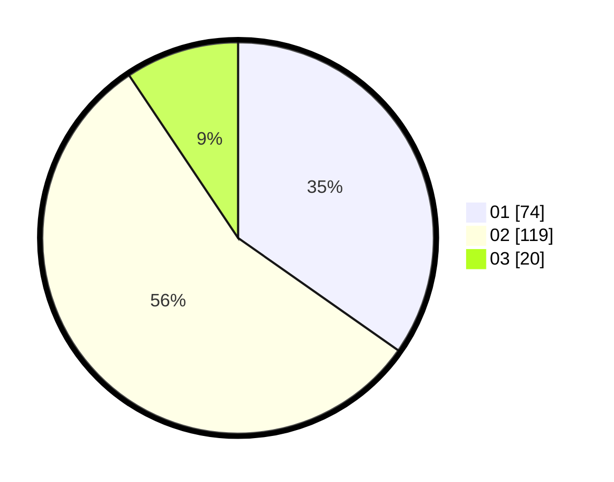

# Hasil

Hasil perolehan suara paslon dapat dilihat pada file paslon-01.txt, paslon-02.txt, dan paslon-03.txt.

Jika tidak ada, artinya data tersebut belum ada pada SIREKAP.

## Perolehan Suara

 * Paslon 01: **74**.
 * Paslon 02: **119**.
 * Paslon 03: **20**.

## Foto C Plano

https://sirekap-obj-formc.kpu.go.id/054e/pemilu/ppwp/31/75/04/10/02/3175041002086-20240217-231327--aa65cfb9-cb4d-4a42-bd61-4149e4c6a5db.jpg

https://sirekap-obj-formc.kpu.go.id/054e/pemilu/ppwp/31/75/04/10/02/3175041002086-20240217-230258--efbe51eb-9a47-4373-9b0a-290ae0688f74.jpg

https://sirekap-obj-formc.kpu.go.id/054e/pemilu/ppwp/31/75/04/10/02/3175041002086-20240214-191626--5ce9b0c3-ff73-4d65-9249-4f4747c578e7.jpg

## DATA PEMILIH TETAP

Jumlah pemilih dalam DPT: **271**.
 * L: **114**.
 * P: **157**.

## DATA PENGGUNA HAK PILIH

Jumlah pengguna hak pilih dalam DPT: **214**.
 * L: **85**.
 * P: **129**.

Jumlah pengguna hak pilih dalam DPTb: **0**.
 * L: **0**.
 * P: **0**.

Jumlah pengguna hak pilih dalam DPK: **1**.
 * L: **1**.
 * P: **0**.

Jumlah pengguna hak pilih: **215**.
 * L: **86**.
 * P: **129**.

## JUMLAH SUARA SAH DAN TIDAK SAH

JUMLAH SELURUH SUARA SAH: **213**.

JUMLAH SUARA TIDAK SAH: **2**.

JUMLAH SELURUH SUARA SAH DAN SUARA TIDAK SAH: **215**.
