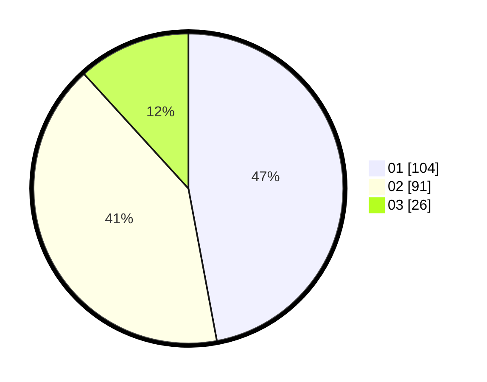

# Hasil

Hasil perolehan suara paslon dapat dilihat pada file paslon-01.txt, paslon-02.txt, dan paslon-03.txt.

Jika tidak ada, artinya data tersebut belum ada pada SIREKAP.

## Perolehan Suara

 * Paslon 01: **104**.
 * Paslon 02: **91**.
 * Paslon 03: **26**.

## Foto C Plano

https://sirekap-obj-formc.kpu.go.id/787a/pemilu/ppwp/31/75/04/10/02/3175041002087-20240216-100014--fc77700d-6965-4f57-b7f0-7d27bab14109.jpg

https://sirekap-obj-formc.kpu.go.id/787a/pemilu/ppwp/31/75/04/10/02/3175041002087-20240216-101008--e95cb1cc-f231-4997-b527-434db6c750bd.jpg

https://sirekap-obj-formc.kpu.go.id/787a/pemilu/ppwp/31/75/04/10/02/3175041002087-20240216-101305--a6279385-77ea-4449-9c3b-ff4dacd2817a.jpg

## DATA PEMILIH TETAP

Jumlah pemilih dalam DPT: **269**.
 * L: **132**.
 * P: **137**.

## DATA PENGGUNA HAK PILIH

Jumlah pengguna hak pilih dalam DPT: **218**.
 * L: **99**.
 * P: **119**.

Jumlah pengguna hak pilih dalam DPTb: **1**.
 * L: **0**.
 * P: **1**.

Jumlah pengguna hak pilih dalam DPK: **5**.
 * L: **3**.
 * P: **2**.

Jumlah pengguna hak pilih: **224**.
 * L: **102**.
 * P: **122**.

## JUMLAH SUARA SAH DAN TIDAK SAH

JUMLAH SELURUH SUARA SAH: **221**.

JUMLAH SUARA TIDAK SAH: **3**.

JUMLAH SELURUH SUARA SAH DAN SUARA TIDAK SAH: **224**.
