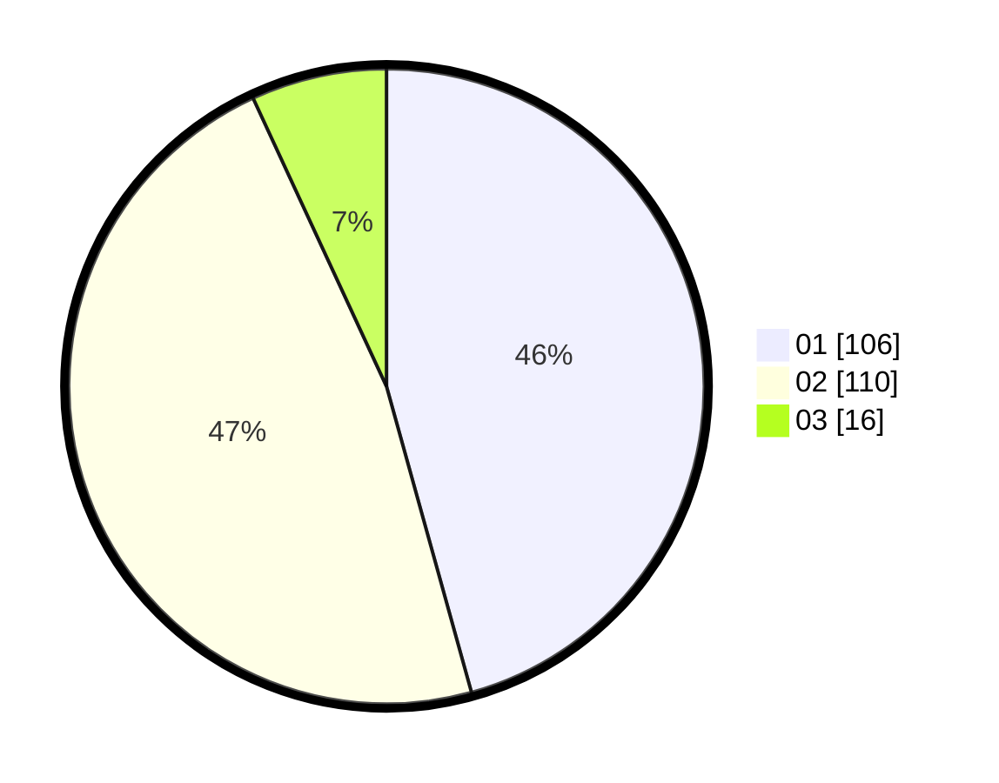

# Hasil

Hasil perolehan suara paslon dapat dilihat pada file paslon-01.txt, paslon-02.txt, dan paslon-03.txt.

Jika tidak ada, artinya data tersebut belum ada pada SIREKAP.

## Perolehan Suara

 * Paslon 01: **106**.
 * Paslon 02: **110**.
 * Paslon 03: **16**.

## Foto C Plano

https://sirekap-obj-formc.kpu.go.id/9c54/pemilu/ppwp/31/75/04/10/02/3175041002090-20240214-235114--a5459ccb-1381-4bed-b9b9-4d33a8db9ed3.jpg

https://sirekap-obj-formc.kpu.go.id/9c54/pemilu/ppwp/31/75/04/10/02/3175041002090-20240217-142927--fb7ac04a-2076-4c95-b60c-4e8eeaa6cce4.jpg

https://sirekap-obj-formc.kpu.go.id/9c54/pemilu/ppwp/31/75/04/10/02/3175041002090-20240217-143030--c877df62-7987-4f72-aa0f-ef129080a241.jpg

## DATA PEMILIH TETAP

Jumlah pemilih dalam DPT: **275**.
 * L: **131**.
 * P: **144**.

## DATA PENGGUNA HAK PILIH

Jumlah pengguna hak pilih dalam DPT: **233**.
 * L: **108**.
 * P: **125**.

Jumlah pengguna hak pilih dalam DPTb: **0**.
 * L: **0**.
 * P: **0**.

Jumlah pengguna hak pilih dalam DPK: **1**.
 * L: **0**.
 * P: **1**.

Jumlah pengguna hak pilih: **234**.
 * L: **108**.
 * P: **126**.

## JUMLAH SUARA SAH DAN TIDAK SAH

JUMLAH SELURUH SUARA SAH: **232**.

JUMLAH SUARA TIDAK SAH: **2**.

JUMLAH SELURUH SUARA SAH DAN SUARA TIDAK SAH: **234**.
