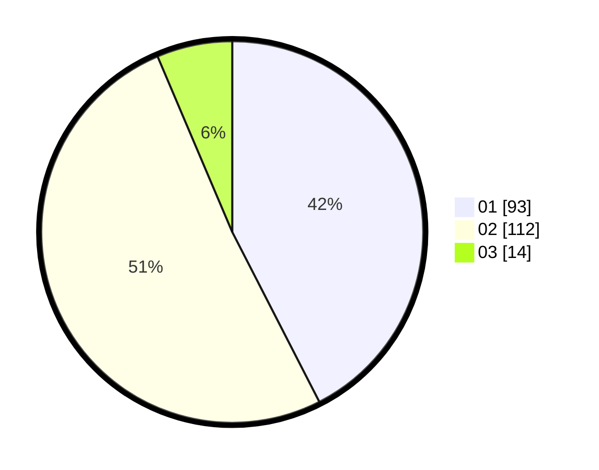

# Hasil

Hasil perolehan suara paslon dapat dilihat pada file paslon-01.txt, paslon-02.txt, dan paslon-03.txt.

Jika tidak ada, artinya data tersebut belum ada pada SIREKAP.

## Perolehan Suara

 * Paslon 01: **93**.
 * Paslon 02: **112**.
 * Paslon 03: **14**.

## Foto C Plano

https://sirekap-obj-formc.kpu.go.id/194c/pemilu/ppwp/31/75/04/10/02/3175041002097-20240217-180011--a3550ca3-0318-4cb4-8cf5-45d623d3da1a.jpg

https://sirekap-obj-formc.kpu.go.id/194c/pemilu/ppwp/31/75/04/10/02/3175041002097-20240217-173251--e79536ad-035f-47c9-8c81-3389f7d29ee8.jpg

https://sirekap-obj-formc.kpu.go.id/194c/pemilu/ppwp/31/75/04/10/02/3175041002097-20240217-175712--c3d09045-ee8b-46f1-9748-c0e1f7b82fc5.jpg
