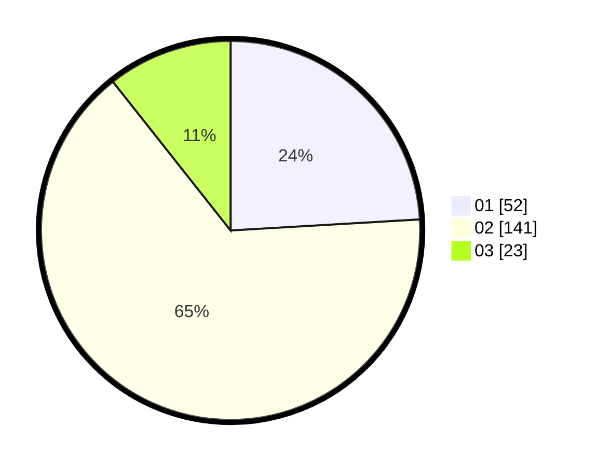

# Hasil

Hasil perolehan suara paslon dapat dilihat pada file paslon-01.txt, paslon-02.txt, dan paslon-03.txt.

Jika tidak ada, artinya data tersebut belum ada pada SIREKAP.

## Perolehan Suara

 * Paslon 01: **52**.
 * Paslon 02: **141**.
 * Paslon 03: **23**.

## Foto C Plano

https://sirekap-obj-formc.kpu.go.id/4681/pemilu/ppwp/31/75/04/10/02/3175041002102-20240217-174840--dcb28c52-e165-4953-8fc9-9e24077074ec.jpg

https://sirekap-obj-formc.kpu.go.id/4681/pemilu/ppwp/31/75/04/10/02/3175041002102-20240217-173856--5bc85bd0-b827-4955-a9e1-3490ee4f0895.jpg

https://sirekap-obj-formc.kpu.go.id/4681/pemilu/ppwp/31/75/04/10/02/3175041002102-20240217-174053--64c3356a-b70a-4865-a2ce-7fa5e224ccca.jpg

## DATA PEMILIH TETAP

Jumlah pemilih dalam DPT: **285**.
 * L: **138**.
 * P: **147**.

## DATA PENGGUNA HAK PILIH

Jumlah pengguna hak pilih dalam DPT: **218**.
 * L: **106**.
 * P: **112**.

Jumlah pengguna hak pilih dalam DPTb: **0**.
 * L: **0**.
 * P: **0**.

Jumlah pengguna hak pilih dalam DPK: **1**.
 * L: **0**.
 * P: **1**.

Jumlah pengguna hak pilih: **219**.
 * L: **106**.
 * P: **113**.

## JUMLAH SUARA SAH DAN TIDAK SAH

JUMLAH SELURUH SUARA SAH: **216**.

JUMLAH SUARA TIDAK SAH: **3**.

JUMLAH SELURUH SUARA SAH DAN SUARA TIDAK SAH: **219**.
