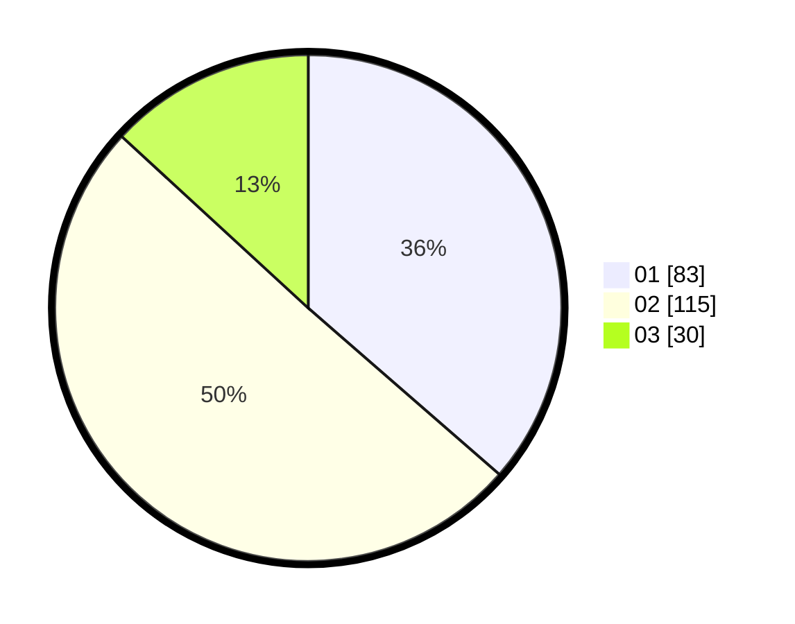

# Hasil

Hasil perolehan suara paslon dapat dilihat pada file paslon-01.txt, paslon-02.txt, dan paslon-03.txt.

Jika tidak ada, artinya data tersebut belum ada pada SIREKAP.

## Perolehan Suara

 * Paslon 01: **83**.
 * Paslon 02: **115**.
 * Paslon 03: **30**.

## Foto C Plano

https://sirekap-obj-formc.kpu.go.id/cdcd/pemilu/ppwp/31/75/04/10/02/3175041002103-20240214-194837--77cd3e51-1991-4b84-a668-b081f6b013cf.jpg

https://sirekap-obj-formc.kpu.go.id/cdcd/pemilu/ppwp/31/75/04/10/02/3175041002103-20240214-200851--39c4be34-68e1-4119-8671-26a439757dd8.jpg

https://sirekap-obj-formc.kpu.go.id/cdcd/pemilu/ppwp/31/75/04/10/02/3175041002103-20240214-195131--7ebfd4cd-5490-400c-84b9-4b41a5f893e1.jpg

## DATA PEMILIH TETAP

Jumlah pemilih dalam DPT: **281**.
 * L: **125**.
 * P: **156**.

## DATA PENGGUNA HAK PILIH

Jumlah pengguna hak pilih dalam DPT: **228**.
 * L: **97**.
 * P: **131**.

Jumlah pengguna hak pilih dalam DPTb: **1**.
 * L: **0**.
 * P: **1**.

Jumlah pengguna hak pilih dalam DPK: **1**.
 * L: **1**.
 * P: **0**.

Jumlah pengguna hak pilih: **230**.
 * L: **98**.
 * P: **132**.

## JUMLAH SUARA SAH DAN TIDAK SAH

JUMLAH SELURUH SUARA SAH: **228**.

JUMLAH SUARA TIDAK SAH: **2**.

JUMLAH SELURUH SUARA SAH DAN SUARA TIDAK SAH: **230**.
