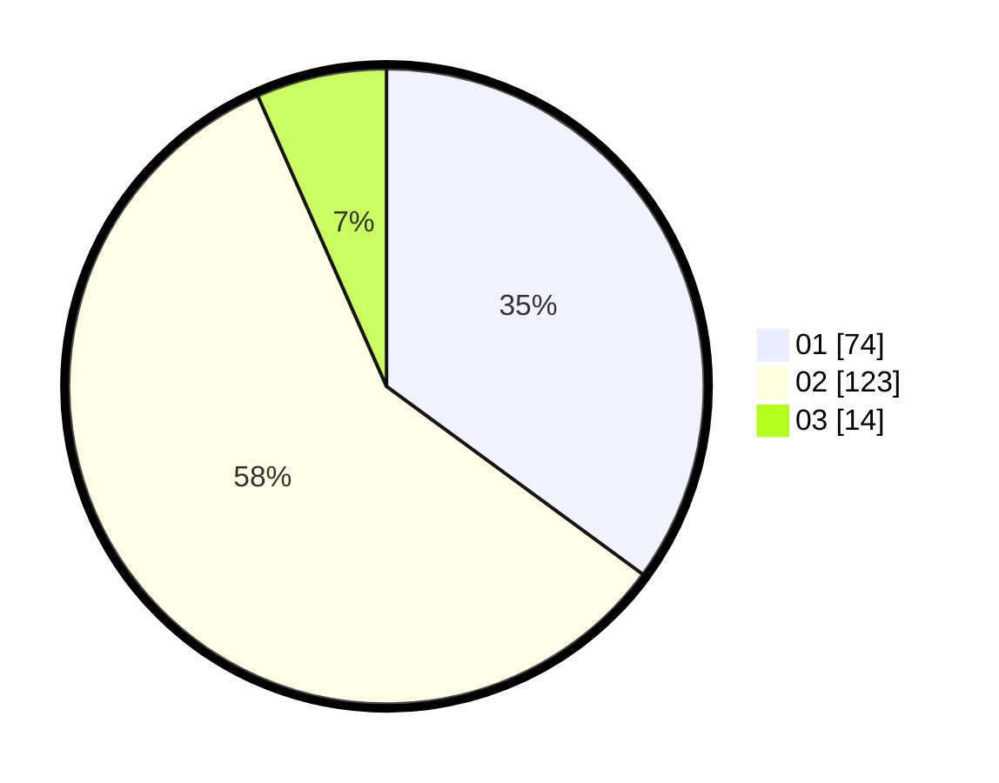

# Hasil

Hasil perolehan suara paslon dapat dilihat pada file paslon-01.txt, paslon-02.txt, dan paslon-03.txt.

Jika tidak ada, artinya data tersebut belum ada pada SIREKAP.

## Perolehan Suara

 * Paslon 01: **74**.
 * Paslon 02: **123**.
 * Paslon 03: **14**.

## Foto C Plano

https://sirekap-obj-formc.kpu.go.id/553a/pemilu/ppwp/31/75/04/10/02/3175041002110-20240217-123318--5b709c77-ba8e-4d71-8138-f4d0c42a66be.jpg

https://sirekap-obj-formc.kpu.go.id/553a/pemilu/ppwp/31/75/04/10/02/3175041002110-20240217-123221--e4c24ac3-2e4b-40a9-a0f6-67907a58d509.jpg

https://sirekap-obj-formc.kpu.go.id/553a/pemilu/ppwp/31/75/04/10/02/3175041002110-20240217-122643--7821728a-1c62-42a1-b85f-52bc2d5e2e7d.jpg

## DATA PEMILIH TETAP

Jumlah pemilih dalam DPT: **289**.
 * L: **140**.
 * P: **149**.

## DATA PENGGUNA HAK PILIH

Jumlah pengguna hak pilih dalam DPT: **210**.
 * L: **100**.
 * P: **110**.

Jumlah pengguna hak pilih dalam DPTb: **1**.
 * L: **1**.
 * P: **0**.

Jumlah pengguna hak pilih dalam DPK: **1**.
 * L: **1**.
 * P: **0**.

Jumlah pengguna hak pilih: **212**.
 * L: **102**.
 * P: **110**.

## JUMLAH SUARA SAH DAN TIDAK SAH

JUMLAH SELURUH SUARA SAH: **211**.

JUMLAH SUARA TIDAK SAH: **1**.

JUMLAH SELURUH SUARA SAH DAN SUARA TIDAK SAH: **212**.
