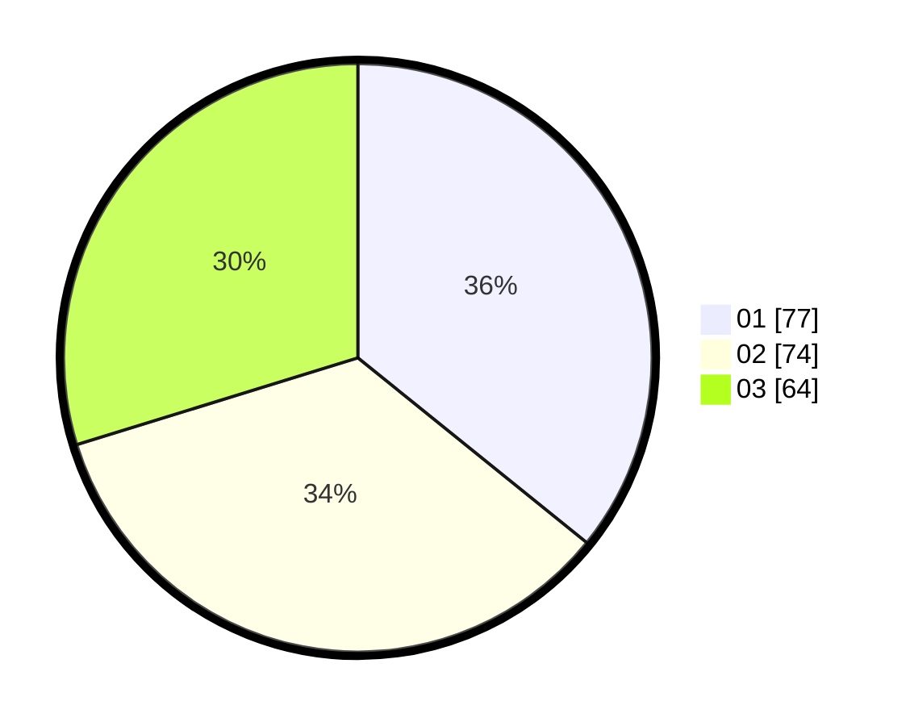

# Hasil

Hasil perolehan suara paslon dapat dilihat pada file paslon-01.txt, paslon-02.txt, dan paslon-03.txt.

Jika tidak ada, artinya data tersebut belum ada pada SIREKAP.

## Perolehan Suara

 * Paslon 01: **77**.
 * Paslon 02: **74**.
 * Paslon 03: **64**.

## Foto C Plano

https://sirekap-obj-formc.kpu.go.id/8f48/pemilu/ppwp/31/75/04/10/02/3175041002112-20240218-210430--2281c99e-23f1-41b0-976c-128f49064ff8.jpg

https://sirekap-obj-formc.kpu.go.id/8f48/pemilu/ppwp/31/75/04/10/02/3175041002112-20240218-205829--e51836c5-b836-4069-adbf-0b5d4d744ac9.jpg

https://sirekap-obj-formc.kpu.go.id/8f48/pemilu/ppwp/31/75/04/10/02/3175041002112-20240218-210039--267d9b54-63bc-4ffb-8eb6-ea9914b53409.jpg

## DATA PEMILIH TETAP

Jumlah pemilih dalam DPT: **264**.
 * L: **131**.
 * P: **133**.

## DATA PENGGUNA HAK PILIH

Jumlah pengguna hak pilih dalam DPT: **215**.
 * L: **107**.
 * P: **108**.

Jumlah pengguna hak pilih dalam DPTb: **1**.
 * L: **0**.
 * P: **1**.

Jumlah pengguna hak pilih dalam DPK: **2**.
 * L: **1**.
 * P: **1**.

Jumlah pengguna hak pilih: **218**.
 * L: **108**.
 * P: **110**.

## JUMLAH SUARA SAH DAN TIDAK SAH

JUMLAH SELURUH SUARA SAH: **215**.

JUMLAH SUARA TIDAK SAH: **3**.

JUMLAH SELURUH SUARA SAH DAN SUARA TIDAK SAH: **218**.
