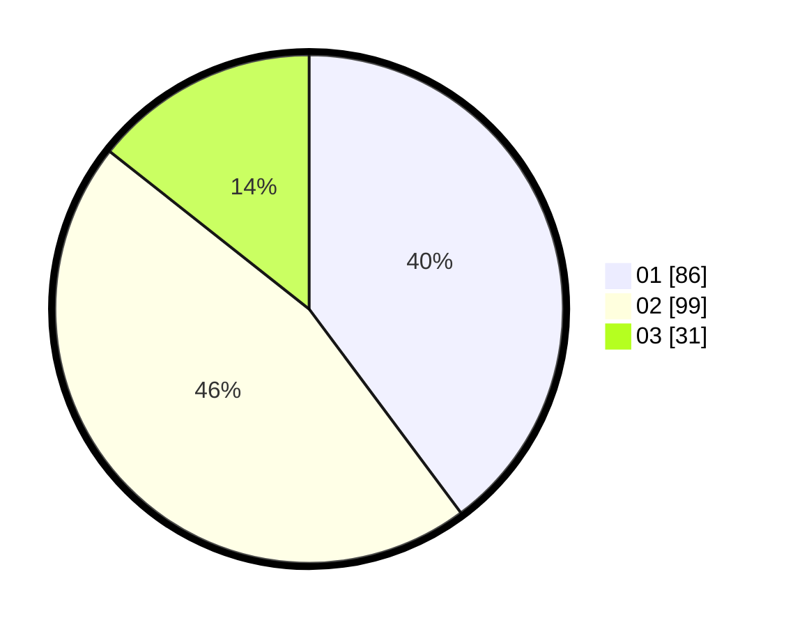

# Hasil

Hasil perolehan suara paslon dapat dilihat pada file paslon-01.txt, paslon-02.txt, dan paslon-03.txt.

Jika tidak ada, artinya data tersebut belum ada pada SIREKAP.

## Perolehan Suara

 * Paslon 01: **86**.
 * Paslon 02: **99**.
 * Paslon 03: **31**.

## Foto C Plano

https://sirekap-obj-formc.kpu.go.id/2a66/pemilu/ppwp/31/75/04/10/02/3175041002113-20240218-184248--d14c5383-9ffa-4a14-a6ad-ad61d6585452.jpg

https://sirekap-obj-formc.kpu.go.id/2a66/pemilu/ppwp/31/75/04/10/02/3175041002113-20240218-184110--966eeb63-f7e6-43f1-9dbc-a10cbd380d02.jpg

https://sirekap-obj-formc.kpu.go.id/2a66/pemilu/ppwp/31/75/04/10/02/3175041002113-20240218-184021--7e4f0e80-5807-4a2a-93e6-90dd4e2bf8eb.jpg

## DATA PEMILIH TETAP

Jumlah pemilih dalam DPT: **269**.
 * L: **127**.
 * P: **142**.

## DATA PENGGUNA HAK PILIH

Jumlah pengguna hak pilih dalam DPT: **220**.
 * L: **103**.
 * P: **117**.

Jumlah pengguna hak pilih dalam DPTb: **1**.
 * L: **0**.
 * P: **1**.

Jumlah pengguna hak pilih dalam DPK: **0**.
 * L: **0**.
 * P: **0**.

Jumlah pengguna hak pilih: **221**.
 * L: **103**.
 * P: **108**.

## JUMLAH SUARA SAH DAN TIDAK SAH

JUMLAH SELURUH SUARA SAH: **216**.

JUMLAH SUARA TIDAK SAH: **5**.

JUMLAH SELURUH SUARA SAH DAN SUARA TIDAK SAH: **221**.
