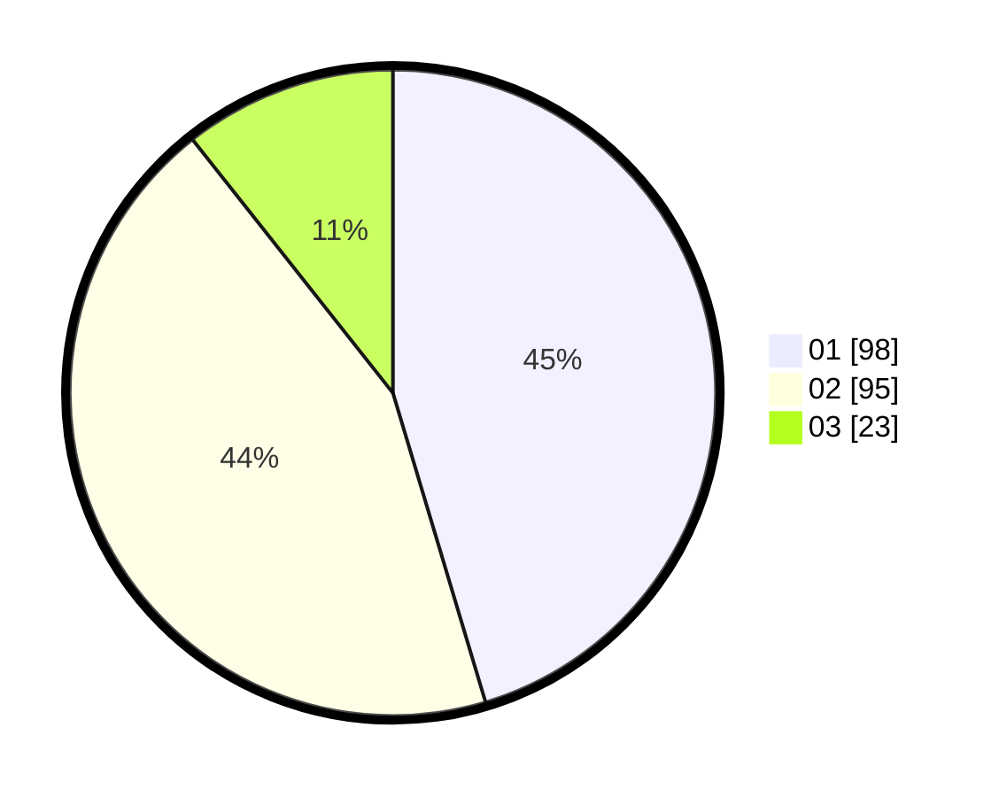

# Hasil

Hasil perolehan suara paslon dapat dilihat pada file paslon-01.txt, paslon-02.txt, dan paslon-03.txt.

Jika tidak ada, artinya data tersebut belum ada pada SIREKAP.

## Perolehan Suara

 * Paslon 01: **98**.
 * Paslon 02: **95**.
 * Paslon 03: **23**.

## Foto C Plano

https://sirekap-obj-formc.kpu.go.id/9a3a/pemilu/ppwp/31/75/04/10/02/3175041002114-20240218-073631--0659f3ed-2f24-40f4-9962-08816761cf8f.jpg

https://sirekap-obj-formc.kpu.go.id/9a3a/pemilu/ppwp/31/75/04/10/02/3175041002114-20240218-073721--5d91fa44-2c88-45f8-947f-bfa3387e10fe.jpg

https://sirekap-obj-formc.kpu.go.id/9a3a/pemilu/ppwp/31/75/04/10/02/3175041002114-20240218-073802--a54b8609-1534-4e42-b361-1f6672985110.jpg

## DATA PEMILIH TETAP

Jumlah pemilih dalam DPT: **278**.
 * L: **137**.
 * P: **141**.

## DATA PENGGUNA HAK PILIH

Jumlah pengguna hak pilih dalam DPT: **218**.
 * L: **103**.
 * P: **115**.

Jumlah pengguna hak pilih dalam DPTb: **1**.
 * L: **1**.
 * P: **0**.

Jumlah pengguna hak pilih dalam DPK: **2**.
 * L: **2**.
 * P: **0**.

Jumlah pengguna hak pilih: **221**.
 * L: **106**.
 * P: **115**.

## JUMLAH SUARA SAH DAN TIDAK SAH

JUMLAH SELURUH SUARA SAH: **216**.

JUMLAH SUARA TIDAK SAH: **5**.

JUMLAH SELURUH SUARA SAH DAN SUARA TIDAK SAH: **221**.
