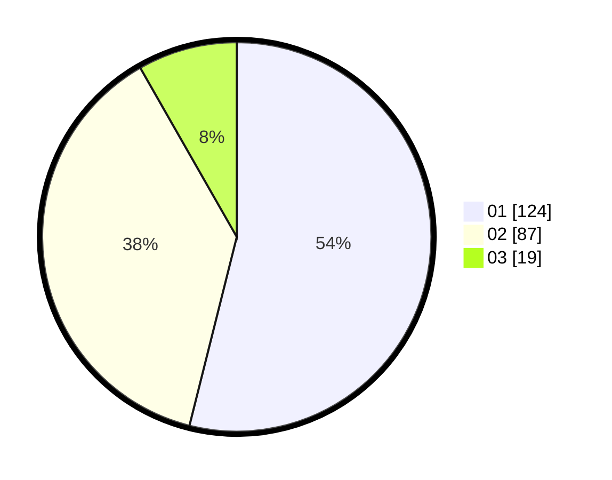

# Hasil

Hasil perolehan suara paslon dapat dilihat pada file paslon-01.txt, paslon-02.txt, dan paslon-03.txt.

Jika tidak ada, artinya data tersebut belum ada pada SIREKAP.

## Perolehan Suara

 * Paslon 01: **124**.
 * Paslon 02: **87**.
 * Paslon 03: **19**.

## Foto C Plano

https://sirekap-obj-formc.kpu.go.id/bff9/pemilu/ppwp/31/75/04/10/02/3175041002115-20240216-212540--5e53c99d-660b-47f5-9c4e-cc1eab6aec78.jpg

https://sirekap-obj-formc.kpu.go.id/bff9/pemilu/ppwp/31/75/04/10/02/3175041002115-20240216-213526--63723013-591b-4a75-973c-cefac80bda3a.jpg

https://sirekap-obj-formc.kpu.go.id/bff9/pemilu/ppwp/31/75/04/10/02/3175041002115-20240219-200155--8baac0f8-66e3-40a9-87cf-2cef8ab224a7.jpg

## DATA PEMILIH TETAP

Jumlah pemilih dalam DPT: **276**.
 * L: **139**.
 * P: **137**.

## DATA PENGGUNA HAK PILIH

Jumlah pengguna hak pilih dalam DPT: **234**.
 * L: **115**.
 * P: **119**.

Jumlah pengguna hak pilih dalam DPTb: **0**.
 * L: **0**.
 * P: **0**.

Jumlah pengguna hak pilih dalam DPK: **0**.
 * L: **0**.
 * P: **0**.

Jumlah pengguna hak pilih: **234**.
 * L: **115**.
 * P: **119**.

## JUMLAH SUARA SAH DAN TIDAK SAH

JUMLAH SELURUH SUARA SAH: **230**.

JUMLAH SUARA TIDAK SAH: **4**.

JUMLAH SELURUH SUARA SAH DAN SUARA TIDAK SAH: **234**.
