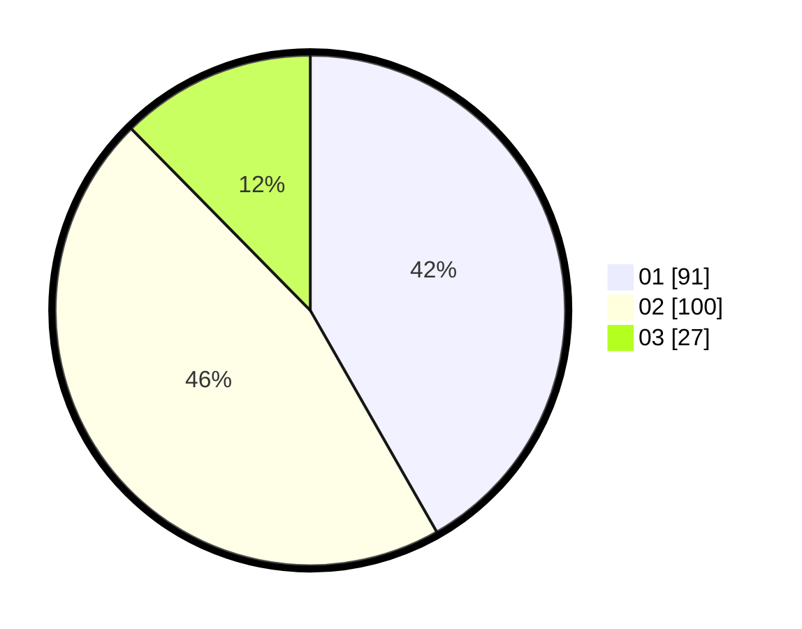

# Hasil

Hasil perolehan suara paslon dapat dilihat pada file paslon-01.txt, paslon-02.txt, dan paslon-03.txt.

Jika tidak ada, artinya data tersebut belum ada pada SIREKAP.

## Perolehan Suara

 * Paslon 01: **91**.
 * Paslon 02: **100**.
 * Paslon 03: **27**.

## Foto C Plano

https://sirekap-obj-formc.kpu.go.id/6d68/pemilu/ppwp/31/75/04/10/02/3175041002117-20240215-032330--0ee9e111-fc49-4168-96a1-02859d1bc6ca.jpg

https://sirekap-obj-formc.kpu.go.id/6d68/pemilu/ppwp/31/75/04/10/02/3175041002117-20240217-125243--2908d300-f8fe-4b8e-94cd-dc678be6d640.jpg

https://sirekap-obj-formc.kpu.go.id/6d68/pemilu/ppwp/31/75/04/10/02/3175041002117-20240217-125341--3dcf0c26-345b-4fa1-8c60-642d08a7b7c0.jpg

## DATA PEMILIH TETAP

Jumlah pemilih dalam DPT: **276**.
 * L: **151**.
 * P: **125**.

## DATA PENGGUNA HAK PILIH

Jumlah pengguna hak pilih dalam DPT: **216**.
 * L: **110**.
 * P: **106**.

Jumlah pengguna hak pilih dalam DPTb: **5**.
 * L: **2**.
 * P: **3**.

Jumlah pengguna hak pilih dalam DPK: **0**.
 * L: **0**.
 * P: **0**.

Jumlah pengguna hak pilih: **221**.
 * L: **112**.
 * P: **109**.

## JUMLAH SUARA SAH DAN TIDAK SAH

JUMLAH SELURUH SUARA SAH: **218**.

JUMLAH SUARA TIDAK SAH: **3**.

JUMLAH SELURUH SUARA SAH DAN SUARA TIDAK SAH: **221**.
