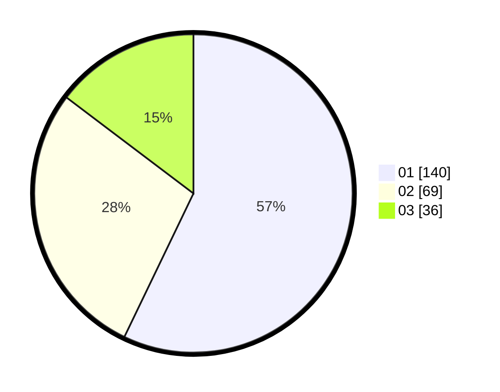

# Hasil

Hasil perolehan suara paslon dapat dilihat pada file paslon-01.txt, paslon-02.txt, dan paslon-03.txt.

Jika tidak ada, artinya data tersebut belum ada pada SIREKAP.

## Perolehan Suara

 * Paslon 01: **140**.
 * Paslon 02: **69**.
 * Paslon 03: **36**.

## Foto C Plano

https://sirekap-obj-formc.kpu.go.id/0a11/pemilu/ppwp/31/75/04/10/02/3175041002125-20240216-225505--4f215fd3-9ca3-4fde-9a3a-a3df1df3a190.jpg

https://sirekap-obj-formc.kpu.go.id/0a11/pemilu/ppwp/31/75/04/10/02/3175041002125-20240216-232358--5df5c351-6399-485e-80e9-559533732917.jpg

https://sirekap-obj-formc.kpu.go.id/0a11/pemilu/ppwp/31/75/04/10/02/3175041002125-20240216-230436--7a38612f-77bd-4a83-b3d1-6b2ac52623da.jpg

## DATA PEMILIH TETAP

Jumlah pemilih dalam DPT: **289**.
 * L: **148**.
 * P: **141**.

## DATA PENGGUNA HAK PILIH

Jumlah pengguna hak pilih dalam DPT: **238**.
 * L: **123**.
 * P: **115**.

Jumlah pengguna hak pilih dalam DPTb: **4**.
 * L: **2**.
 * P: **2**.

Jumlah pengguna hak pilih dalam DPK: **4**.
 * L: **3**.
 * P: **1**.

Jumlah pengguna hak pilih: **246**.
 * L: **128**.
 * P: **118**.

## JUMLAH SUARA SAH DAN TIDAK SAH

JUMLAH SELURUH SUARA SAH: **245**.

JUMLAH SUARA TIDAK SAH: **1**.

JUMLAH SELURUH SUARA SAH DAN SUARA TIDAK SAH: **246**.
