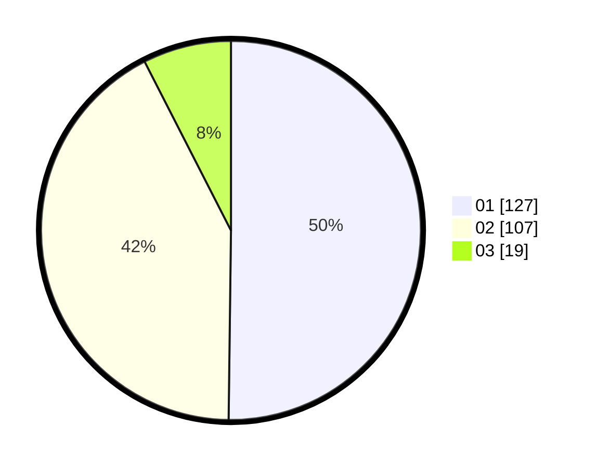

# Hasil

Hasil perolehan suara paslon dapat dilihat pada file paslon-01.txt, paslon-02.txt, dan paslon-03.txt.

Jika tidak ada, artinya data tersebut belum ada pada SIREKAP.

## Perolehan Suara

 * Paslon 01: **127**.
 * Paslon 02: **107**.
 * Paslon 03: **19**.

## Foto C Plano

https://sirekap-obj-formc.kpu.go.id/d45e/pemilu/ppwp/31/75/04/10/02/3175041002126-20240217-171447--9f465130-3b88-4383-890b-b67558278c17.jpg

https://sirekap-obj-formc.kpu.go.id/d45e/pemilu/ppwp/31/75/04/10/02/3175041002126-20240217-171858--460a2208-bb21-4267-a433-a0fbd8f1e33b.jpg

https://sirekap-obj-formc.kpu.go.id/d45e/pemilu/ppwp/31/75/04/10/02/3175041002126-20240217-172013--e1285d17-0f9d-4e5c-a562-5e2f80cca927.jpg

## DATA PEMILIH TETAP

Jumlah pemilih dalam DPT: **295**.
 * L: **143**.
 * P: **152**.

## DATA PENGGUNA HAK PILIH

Jumlah pengguna hak pilih dalam DPT: **251**.
 * L: **118**.
 * P: **133**.

Jumlah pengguna hak pilih dalam DPTb: **3**.
 * L: **2**.
 * P: **1**.

Jumlah pengguna hak pilih dalam DPK: **2**.
 * L: **0**.
 * P: **2**.

Jumlah pengguna hak pilih: **256**.
 * L: **120**.
 * P: **136**.

## JUMLAH SUARA SAH DAN TIDAK SAH

JUMLAH SELURUH SUARA SAH: **253**.

JUMLAH SUARA TIDAK SAH: **3**.

JUMLAH SELURUH SUARA SAH DAN SUARA TIDAK SAH: **256**.
