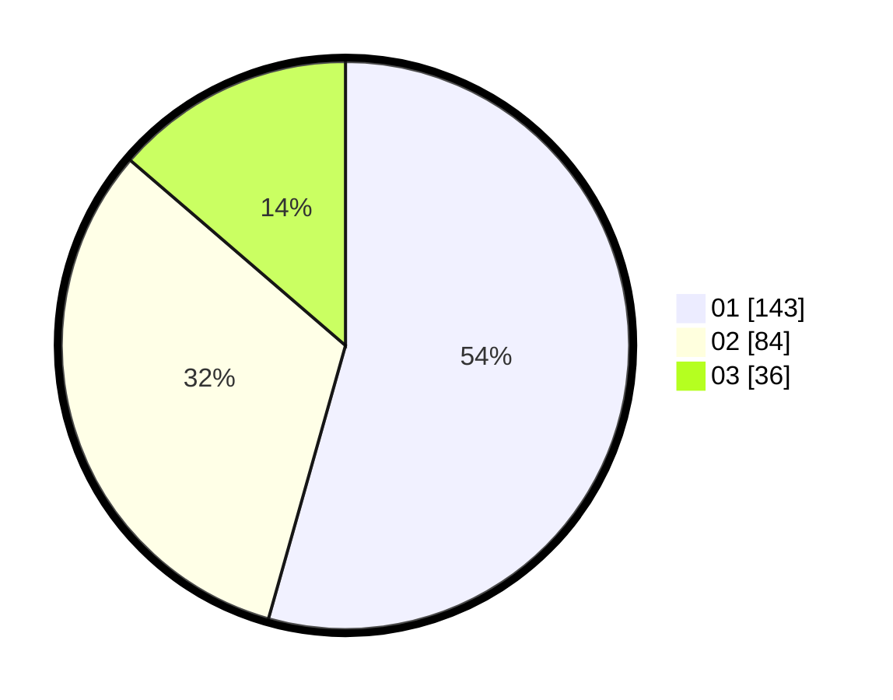

# Hasil

Hasil perolehan suara paslon dapat dilihat pada file paslon-01.txt, paslon-02.txt, dan paslon-03.txt.

Jika tidak ada, artinya data tersebut belum ada pada SIREKAP.

## Perolehan Suara

 * Paslon 01: **143**.
 * Paslon 02: **84**.
 * Paslon 03: **36**.

## Foto C Plano

https://sirekap-obj-formc.kpu.go.id/0a95/pemilu/ppwp/31/75/04/10/02/3175041002127-20240217-183332--eb025ee9-bf1f-4d88-9407-5c8885cd1f23.jpg

https://sirekap-obj-formc.kpu.go.id/0a95/pemilu/ppwp/31/75/04/10/02/3175041002127-20240217-183616--1c389db8-57b7-4905-8290-4c5e4337ed3c.jpg

https://sirekap-obj-formc.kpu.go.id/0a95/pemilu/ppwp/31/75/04/10/02/3175041002127-20240217-184011--162dfd1d-3357-4a8e-bee0-229b60bc967c.jpg

## DATA PEMILIH TETAP

Jumlah pemilih dalam DPT: **297**.
 * L: **148**.
 * P: **149**.

## DATA PENGGUNA HAK PILIH

Jumlah pengguna hak pilih dalam DPT: **263**.
 * L: **129**.
 * P: **134**.

Jumlah pengguna hak pilih dalam DPTb: **0**.
 * L: **0**.
 * P: **0**.

Jumlah pengguna hak pilih dalam DPK: **4**.
 * L: **2**.
 * P: **2**.

Jumlah pengguna hak pilih: **267**.
 * L: **131**.
 * P: **136**.

## JUMLAH SUARA SAH DAN TIDAK SAH

JUMLAH SELURUH SUARA SAH: **263**.

JUMLAH SUARA TIDAK SAH: **4**.

JUMLAH SELURUH SUARA SAH DAN SUARA TIDAK SAH: **267**.
