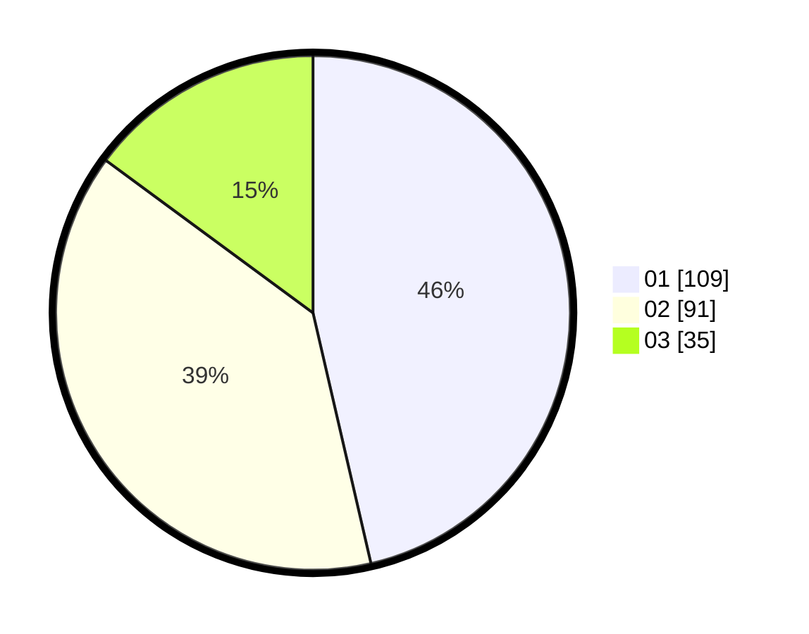

# Hasil

Hasil perolehan suara paslon dapat dilihat pada file paslon-01.txt, paslon-02.txt, dan paslon-03.txt.

Jika tidak ada, artinya data tersebut belum ada pada SIREKAP.

## Perolehan Suara

 * Paslon 01: **109**.
 * Paslon 02: **91**.
 * Paslon 03: **35**.

## Foto C Plano

https://sirekap-obj-formc.kpu.go.id/7fb1/pemilu/ppwp/31/75/04/10/02/3175041002130-20240216-155000--27045afc-f724-4909-8df0-06076ce095dd.jpg

https://sirekap-obj-formc.kpu.go.id/7fb1/pemilu/ppwp/31/75/04/10/02/3175041002130-20240216-153726--d83e14fc-9418-434e-afb2-782f9c61d158.jpg

https://sirekap-obj-formc.kpu.go.id/7fb1/pemilu/ppwp/31/75/04/10/02/3175041002130-20240216-153921--172cb737-6c60-429e-929c-cc306947c1b7.jpg

## DATA PEMILIH TETAP

Jumlah pemilih dalam DPT: **290**.
 * L: **143**.
 * P: **147**.

## DATA PENGGUNA HAK PILIH

Jumlah pengguna hak pilih dalam DPT: **236**.
 * L: **109**.
 * P: **127**.

Jumlah pengguna hak pilih dalam DPTb: **2**.
 * L: **0**.
 * P: **2**.

Jumlah pengguna hak pilih dalam DPK: **0**.
 * L: **0**.
 * P: **0**.

Jumlah pengguna hak pilih: **238**.
 * L: **109**.
 * P: **129**.

## JUMLAH SUARA SAH DAN TIDAK SAH

JUMLAH SELURUH SUARA SAH: **235**.

JUMLAH SUARA TIDAK SAH: **3**.

JUMLAH SELURUH SUARA SAH DAN SUARA TIDAK SAH: **238**.
