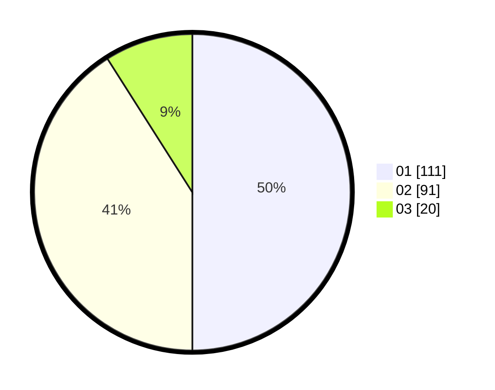

# Hasil

Hasil perolehan suara paslon dapat dilihat pada file paslon-01.txt, paslon-02.txt, dan paslon-03.txt.

Jika tidak ada, artinya data tersebut belum ada pada SIREKAP.

## Perolehan Suara

 * Paslon 01: **111**.
 * Paslon 02: **91**.
 * Paslon 03: **20**.

## Foto C Plano

https://sirekap-obj-formc.kpu.go.id/b682/pemilu/ppwp/31/75/04/10/02/3175041002134-20240216-154724--635d2887-d927-403b-8d98-d6c7d6ed5caf.jpg

https://sirekap-obj-formc.kpu.go.id/b682/pemilu/ppwp/31/75/04/10/02/3175041002134-20240216-155733--0688303f-ee9f-4a43-9018-64bf59c7a455.jpg

https://sirekap-obj-formc.kpu.go.id/b682/pemilu/ppwp/31/75/04/10/02/3175041002134-20240216-160903--7854ab08-692d-4f98-8f04-83bb30823c49.jpg

## DATA PEMILIH TETAP

Jumlah pemilih dalam DPT: **293**.
 * L: **151**.
 * P: **142**.

## DATA PENGGUNA HAK PILIH

Jumlah pengguna hak pilih dalam DPT: **226**.
 * L: **114**.
 * P: **112**.

Jumlah pengguna hak pilih dalam DPTb: **0**.
 * L: **0**.
 * P: **0**.

Jumlah pengguna hak pilih dalam DPK: **0**.
 * L: **0**.
 * P: **0**.

Jumlah pengguna hak pilih: **226**.
 * L: **114**.
 * P: **112**.

## JUMLAH SUARA SAH DAN TIDAK SAH

JUMLAH SELURUH SUARA SAH: **222**.

JUMLAH SUARA TIDAK SAH: **4**.

JUMLAH SELURUH SUARA SAH DAN SUARA TIDAK SAH: **226**.
