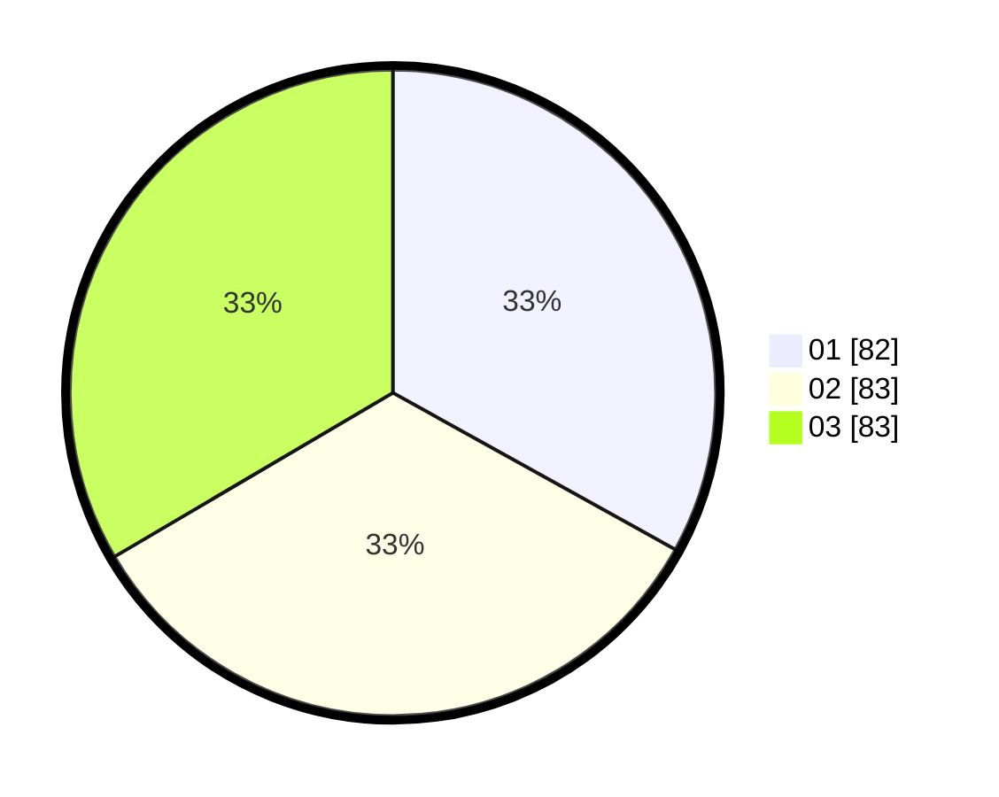

# Hasil

Hasil perolehan suara paslon dapat dilihat pada file paslon-01.txt, paslon-02.txt, dan paslon-03.txt.

Jika tidak ada, artinya data tersebut belum ada pada SIREKAP.

## Perolehan Suara

 * Paslon 01: **82**.
 * Paslon 02: **83**.
 * Paslon 03: **83**.

## Foto C Plano

https://sirekap-obj-formc.kpu.go.id/cc29/pemilu/ppwp/31/75/04/10/02/3175041002135-20240217-195005--56be6714-8b1a-4691-87f2-1ebf824affe0.jpg

https://sirekap-obj-formc.kpu.go.id/cc29/pemilu/ppwp/31/75/04/10/02/3175041002135-20240217-194512--39921144-ff73-4add-a963-67b61999ec8a.jpg

https://sirekap-obj-formc.kpu.go.id/cc29/pemilu/ppwp/31/75/04/10/02/3175041002135-20240217-194847--31f70e08-deec-4145-a30b-e4a39540d6b3.jpg

## DATA PEMILIH TETAP

Jumlah pemilih dalam DPT: **271**.
 * L: **125**.
 * P: **146**.

## DATA PENGGUNA HAK PILIH

Jumlah pengguna hak pilih dalam DPT: **192**.
 * L: **88**.
 * P: **104**.

Jumlah pengguna hak pilih dalam DPTb: **0**.
 * L: **0**.
 * P: **0**.

Jumlah pengguna hak pilih dalam DPK: **3**.
 * L: **3**.
 * P: **0**.

Jumlah pengguna hak pilih: **195**.
 * L: **91**.
 * P: **104**.

## JUMLAH SUARA SAH DAN TIDAK SAH

JUMLAH SELURUH SUARA SAH: **188**.

JUMLAH SUARA TIDAK SAH: **7**.

JUMLAH SELURUH SUARA SAH DAN SUARA TIDAK SAH: **195**.
