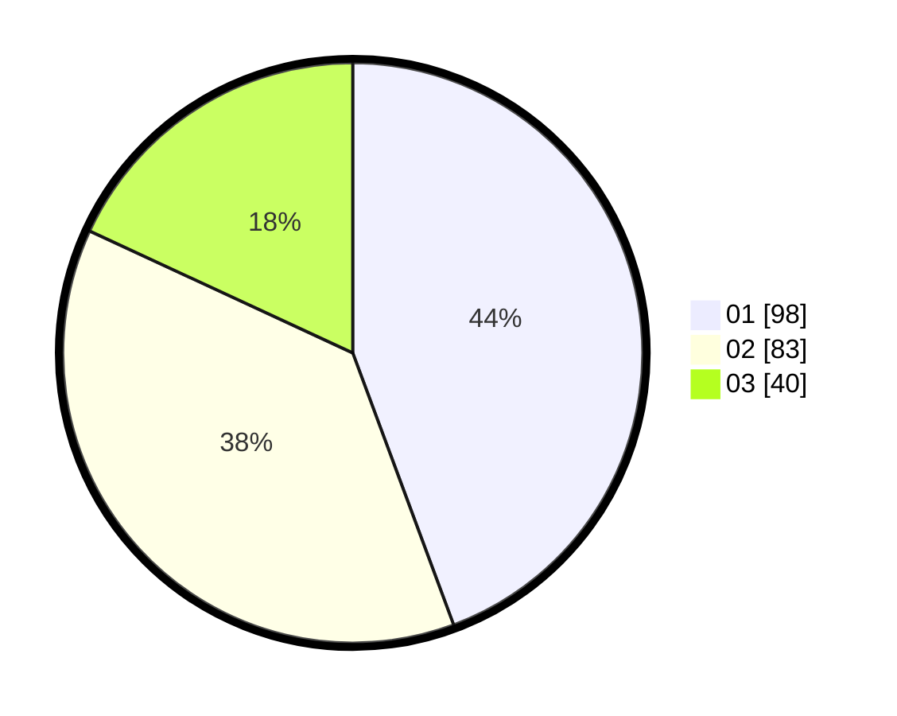

# Hasil

Hasil perolehan suara paslon dapat dilihat pada file paslon-01.txt, paslon-02.txt, dan paslon-03.txt.

Jika tidak ada, artinya data tersebut belum ada pada SIREKAP.

## Perolehan Suara

 * Paslon 01: **98**.
 * Paslon 02: **83**.
 * Paslon 03: **40**.

## Foto C Plano

https://sirekap-obj-formc.kpu.go.id/f6c4/pemilu/ppwp/31/75/04/10/02/3175041002138-20240217-105310--2ab859a9-5670-4802-a9dc-e08106f349cc.jpg

https://sirekap-obj-formc.kpu.go.id/f6c4/pemilu/ppwp/31/75/04/10/02/3175041002138-20240217-105642--90858b4b-1c93-4186-9470-d4a47595fe90.jpg

https://sirekap-obj-formc.kpu.go.id/f6c4/pemilu/ppwp/31/75/04/10/02/3175041002138-20240217-105748--cc973bc2-ce3a-4fbf-863a-26e7d3e65509.jpg

## DATA PEMILIH TETAP

Jumlah pemilih dalam DPT: **264**.
 * L: **135**.
 * P: **129**.

## DATA PENGGUNA HAK PILIH

Jumlah pengguna hak pilih dalam DPT: **221**.
 * L: **106**.
 * P: **115**.

Jumlah pengguna hak pilih dalam DPTb: **0**.
 * L: **0**.
 * P: **0**.

Jumlah pengguna hak pilih dalam DPK: **4**.
 * L: **2**.
 * P: **2**.

Jumlah pengguna hak pilih: **225**.
 * L: **108**.
 * P: **117**.

## JUMLAH SUARA SAH DAN TIDAK SAH

JUMLAH SELURUH SUARA SAH: **221**.

JUMLAH SUARA TIDAK SAH: **4**.

JUMLAH SELURUH SUARA SAH DAN SUARA TIDAK SAH: **225**.
