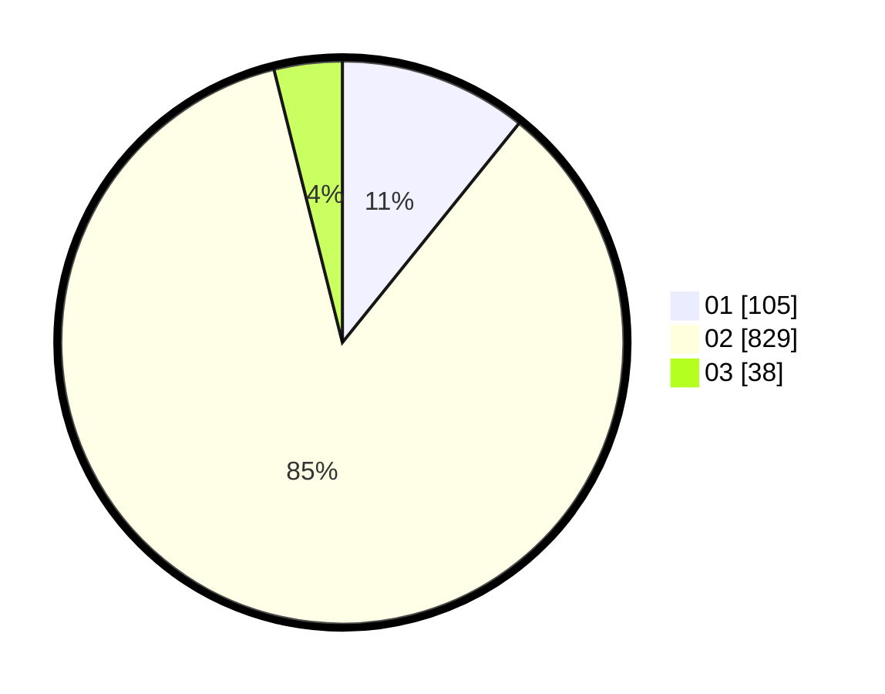

# Hasil

Hasil perolehan suara paslon dapat dilihat pada file paslon-01.txt, paslon-02.txt, dan paslon-03.txt.

Jika tidak ada, artinya data tersebut belum ada pada SIREKAP.

## Perolehan Suara

 * Paslon 01: **105**.
 * Paslon 02: **829**.
 * Paslon 03: **38**.

## Foto C Plano

https://sirekap-obj-formc.kpu.go.id/afa0/pemilu/ppwp/31/75/04/10/02/3175041002146-20240219-123148--07360882-ef5a-4a8b-ae0e-4cfe716c1f56.jpg

https://sirekap-obj-formc.kpu.go.id/afa0/pemilu/ppwp/31/75/04/10/02/3175041002146-20240219-124631--0ba97d84-498d-4a7e-bbdf-53e8816eda14.jpg

https://sirekap-obj-formc.kpu.go.id/afa0/pemilu/ppwp/31/75/04/10/02/3175041002146-20240219-124854--232d9b5f-c807-49c9-9b57-9c64e799ec9f.jpg

## DATA PEMILIH TETAP

Jumlah pemilih dalam DPT: **265**.
 * L: **128**.
 * P: **137**.

## DATA PENGGUNA HAK PILIH

Jumlah pengguna hak pilih dalam DPT: **217**.
 * L: **102**.
 * P: **115**.

Jumlah pengguna hak pilih dalam DPTb: **6**.
 * L: **3**.
 * P: **3**.

Jumlah pengguna hak pilih dalam DPK: **3**.
 * L: **2**.
 * P: **1**.

Jumlah pengguna hak pilih: **226**.
 * L: **107**.
 * P: **119**.

## JUMLAH SUARA SAH DAN TIDAK SAH

JUMLAH SELURUH SUARA SAH: **222**.

JUMLAH SUARA TIDAK SAH: **4**.

JUMLAH SELURUH SUARA SAH DAN SUARA TIDAK SAH: **226**.
