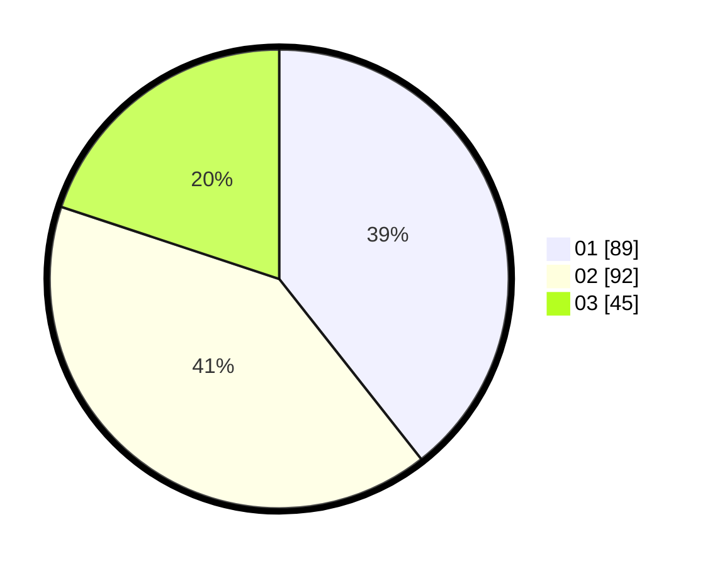

# Hasil

Hasil perolehan suara paslon dapat dilihat pada file paslon-01.txt, paslon-02.txt, dan paslon-03.txt.

Jika tidak ada, artinya data tersebut belum ada pada SIREKAP.

## Perolehan Suara

 * Paslon 01: **89**.
 * Paslon 02: **92**.
 * Paslon 03: **45**.

## Foto C Plano

https://sirekap-obj-formc.kpu.go.id/97cd/pemilu/ppwp/31/75/04/10/03/3175041003013-20240214-214552--2464e843-75d2-46f0-bb5f-4ba9ff0c1abb.jpg

https://sirekap-obj-formc.kpu.go.id/97cd/pemilu/ppwp/31/75/04/10/03/3175041003013-20240214-214649--4fd6a3e7-f34b-4470-8db9-400a265e14ca.jpg

https://sirekap-obj-formc.kpu.go.id/97cd/pemilu/ppwp/31/75/04/10/03/3175041003013-20240214-214724--f4d12a89-88e2-45b5-8f53-aac20d465744.jpg
