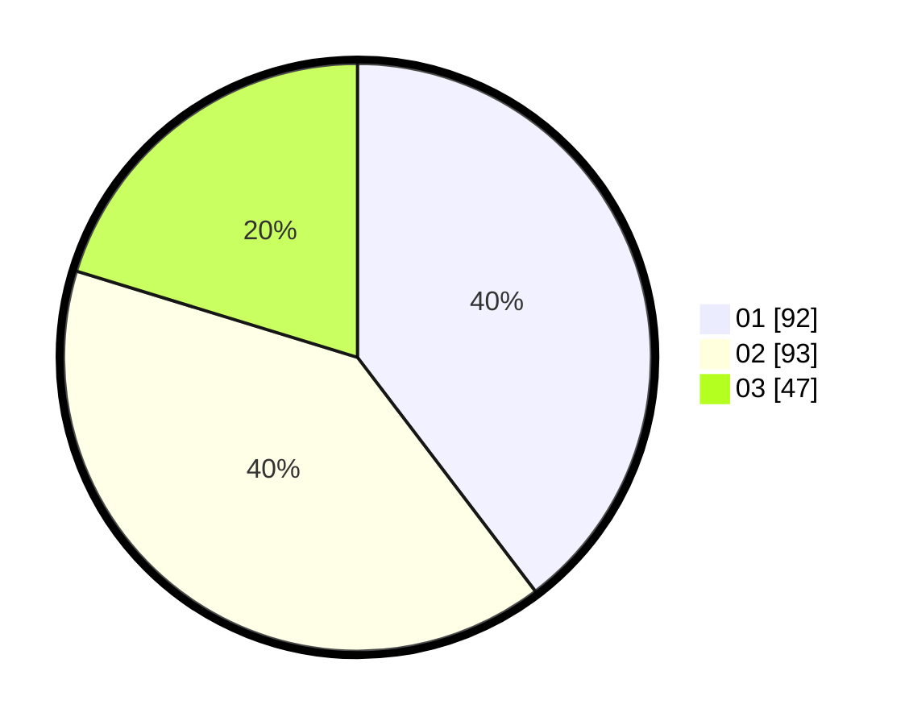

# Hasil

Hasil perolehan suara paslon dapat dilihat pada file paslon-01.txt, paslon-02.txt, dan paslon-03.txt.

Jika tidak ada, artinya data tersebut belum ada pada SIREKAP.

## Perolehan Suara

 * Paslon 01: **92**.
 * Paslon 02: **93**.
 * Paslon 03: **47**.

## Foto C Plano

https://sirekap-obj-formc.kpu.go.id/7178/pemilu/ppwp/31/75/04/10/03/3175041003015-20240215-222710--e6f8b81a-fc70-465e-a66d-073cee530f3c.jpg

https://sirekap-obj-formc.kpu.go.id/7178/pemilu/ppwp/31/75/04/10/03/3175041003015-20240215-223141--1a66ec92-57be-4e29-8dab-9570f1f3a39c.jpg

https://sirekap-obj-formc.kpu.go.id/7178/pemilu/ppwp/31/75/04/10/03/3175041003015-20240215-223705--6c83eae4-69ba-4ffe-b7d3-95f97fe12f4f.jpg

## DATA PEMILIH TETAP

Jumlah pemilih dalam DPT: **266**.
 * L: **133**.
 * P: **133**.

## DATA PENGGUNA HAK PILIH

Jumlah pengguna hak pilih dalam DPT: **227**.
 * L: **109**.
 * P: **118**.

Jumlah pengguna hak pilih dalam DPTb: **5**.
 * L: **3**.
 * P: **2**.

Jumlah pengguna hak pilih dalam DPK: **5**.
 * L: **2**.
 * P: **3**.

Jumlah pengguna hak pilih: **237**.
 * L: **114**.
 * P: **123**.

## JUMLAH SUARA SAH DAN TIDAK SAH

JUMLAH SELURUH SUARA SAH: **232**.

JUMLAH SUARA TIDAK SAH: **5**.

JUMLAH SELURUH SUARA SAH DAN SUARA TIDAK SAH: **237**.
