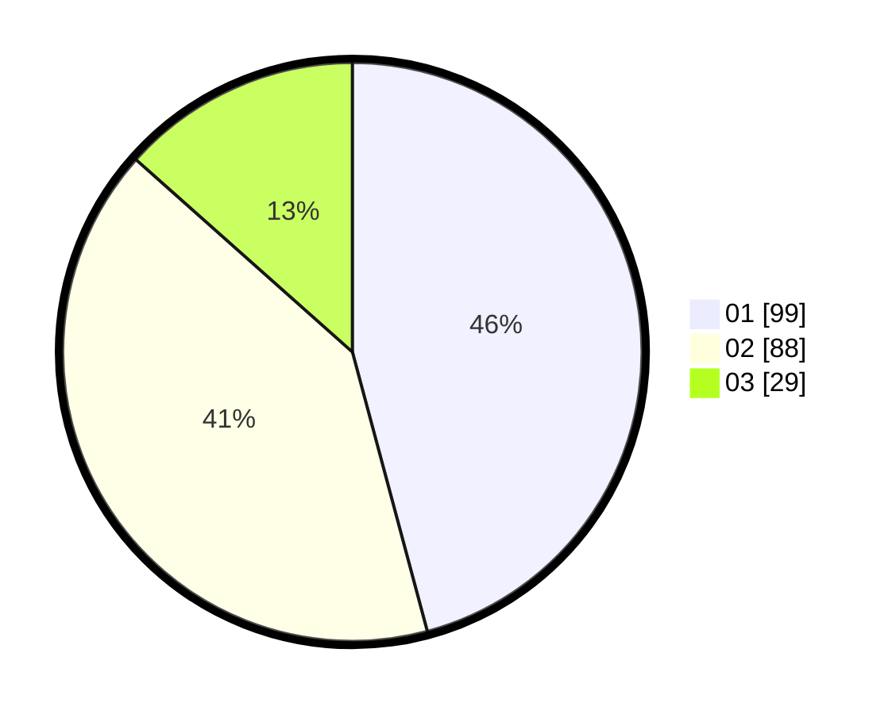

# Hasil

Hasil perolehan suara paslon dapat dilihat pada file paslon-01.txt, paslon-02.txt, dan paslon-03.txt.

Jika tidak ada, artinya data tersebut belum ada pada SIREKAP.

## Perolehan Suara

 * Paslon 01: **99**.
 * Paslon 02: **88**.
 * Paslon 03: **29**.

## Foto C Plano

https://sirekap-obj-formc.kpu.go.id/b6d0/pemilu/ppwp/31/75/04/10/03/3175041003021-20240214-201616--8be2824f-4879-49b5-b810-f5a02bab1694.jpg

https://sirekap-obj-formc.kpu.go.id/b6d0/pemilu/ppwp/31/75/04/10/03/3175041003021-20240214-201800--66ad3369-7deb-4849-a1bb-100df62d7bc2.jpg

https://sirekap-obj-formc.kpu.go.id/b6d0/pemilu/ppwp/31/75/04/10/03/3175041003021-20240214-201917--406d1d5f-03e8-475d-a82b-7d2d5848634f.jpg
