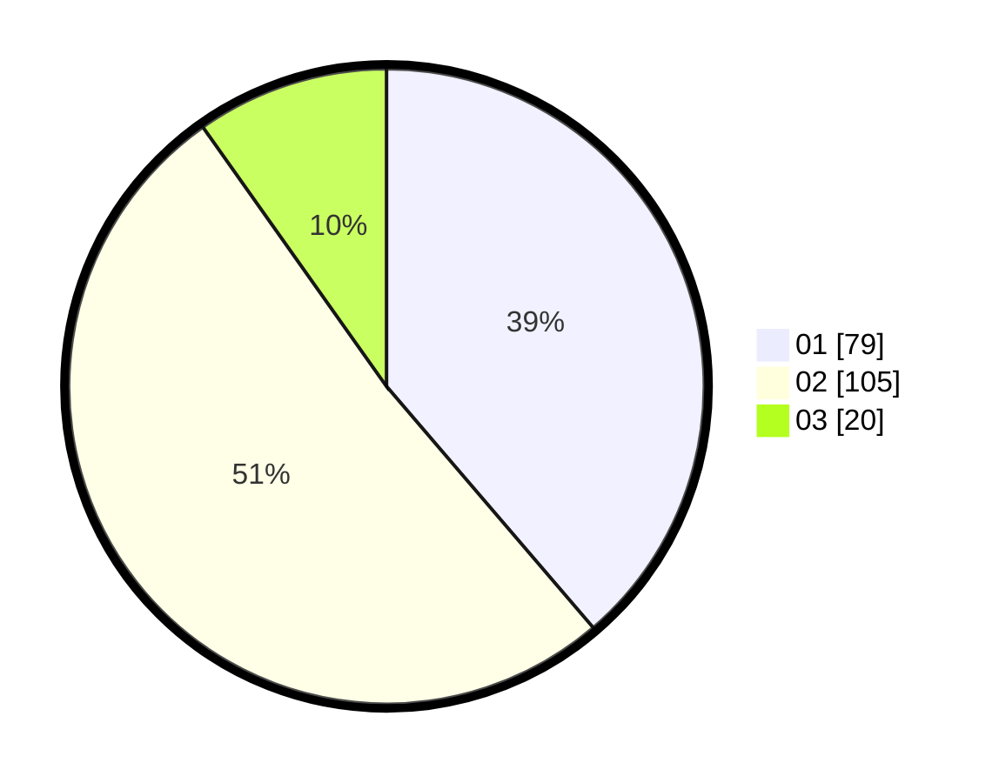

# Hasil

Hasil perolehan suara paslon dapat dilihat pada file paslon-01.txt, paslon-02.txt, dan paslon-03.txt.

Jika tidak ada, artinya data tersebut belum ada pada SIREKAP.

## Perolehan Suara

 * Paslon 01: **79**.
 * Paslon 02: **105**.
 * Paslon 03: **20**.

## Foto C Plano

https://sirekap-obj-formc.kpu.go.id/14b5/pemilu/ppwp/31/75/04/10/03/3175041003028-20240214-155526--dc9bc8a5-ff4d-42c6-817c-9b832b854fe4.jpg

https://sirekap-obj-formc.kpu.go.id/14b5/pemilu/ppwp/31/75/04/10/03/3175041003028-20240214-155606--513bb7ff-e0b7-4c61-b8f6-7d21125a0ce4.jpg

https://sirekap-obj-formc.kpu.go.id/14b5/pemilu/ppwp/31/75/04/10/03/3175041003028-20240214-155702--2eaa51c6-c628-4bf5-971e-fc0189a1408f.jpg

## DATA PEMILIH TETAP

Jumlah pemilih dalam DPT: **260**.
 * L: **145**.
 * P: **115**.

## DATA PENGGUNA HAK PILIH

Jumlah pengguna hak pilih dalam DPT: **205**.
 * L: **109**.
 * P: **96**.

Jumlah pengguna hak pilih dalam DPTb: **0**.
 * L: **0**.
 * P: **0**.

Jumlah pengguna hak pilih dalam DPK: **2**.
 * L: **1**.
 * P: **1**.

Jumlah pengguna hak pilih: **207**.
 * L: **110**.
 * P: **97**.

## JUMLAH SUARA SAH DAN TIDAK SAH

JUMLAH SELURUH SUARA SAH: **204**.

JUMLAH SUARA TIDAK SAH: **3**.

JUMLAH SELURUH SUARA SAH DAN SUARA TIDAK SAH: **207**.
