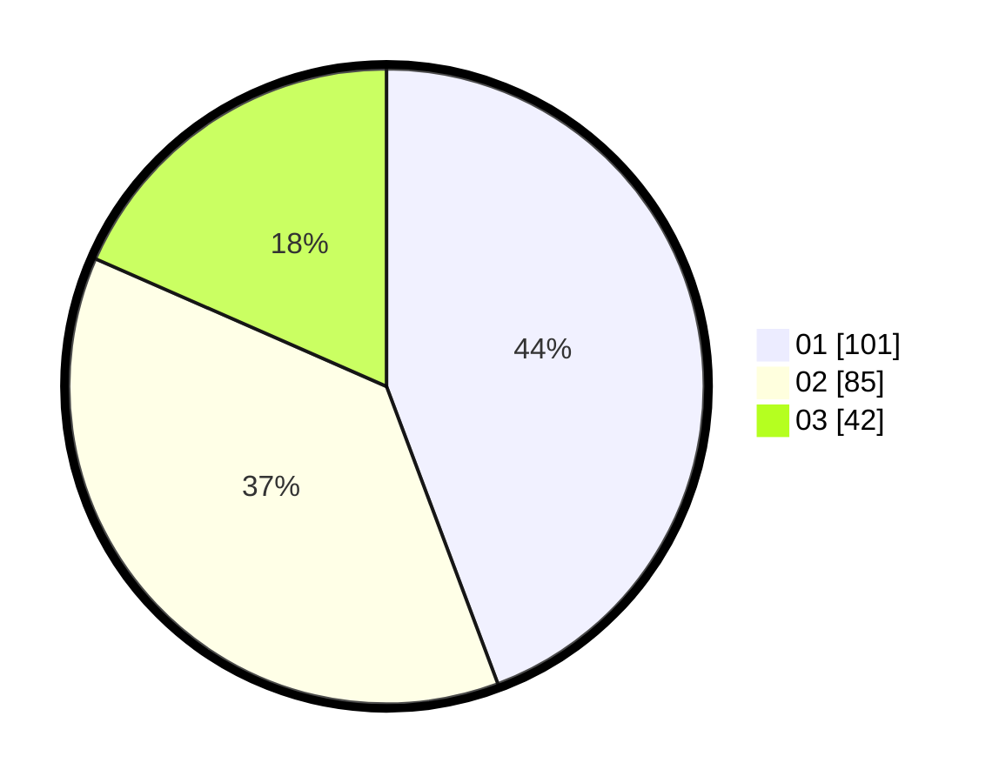

# Hasil

Hasil perolehan suara paslon dapat dilihat pada file paslon-01.txt, paslon-02.txt, dan paslon-03.txt.

Jika tidak ada, artinya data tersebut belum ada pada SIREKAP.

## Perolehan Suara

 * Paslon 01: **101**.
 * Paslon 02: **85**.
 * Paslon 03: **42**.

## Foto C Plano

https://sirekap-obj-formc.kpu.go.id/ff32/pemilu/ppwp/31/75/04/10/03/3175041003039-20240214-233322--02d3d446-7f64-46f6-a879-cbc5d79d89cb.jpg

https://sirekap-obj-formc.kpu.go.id/ff32/pemilu/ppwp/31/75/04/10/03/3175041003039-20240214-233635--7e5d98be-2266-40d5-a1be-660e0ce9560c.jpg

https://sirekap-obj-formc.kpu.go.id/ff32/pemilu/ppwp/31/75/04/10/03/3175041003039-20240214-233940--b714af60-543d-4d12-aabd-1aae7dbf9c88.jpg
