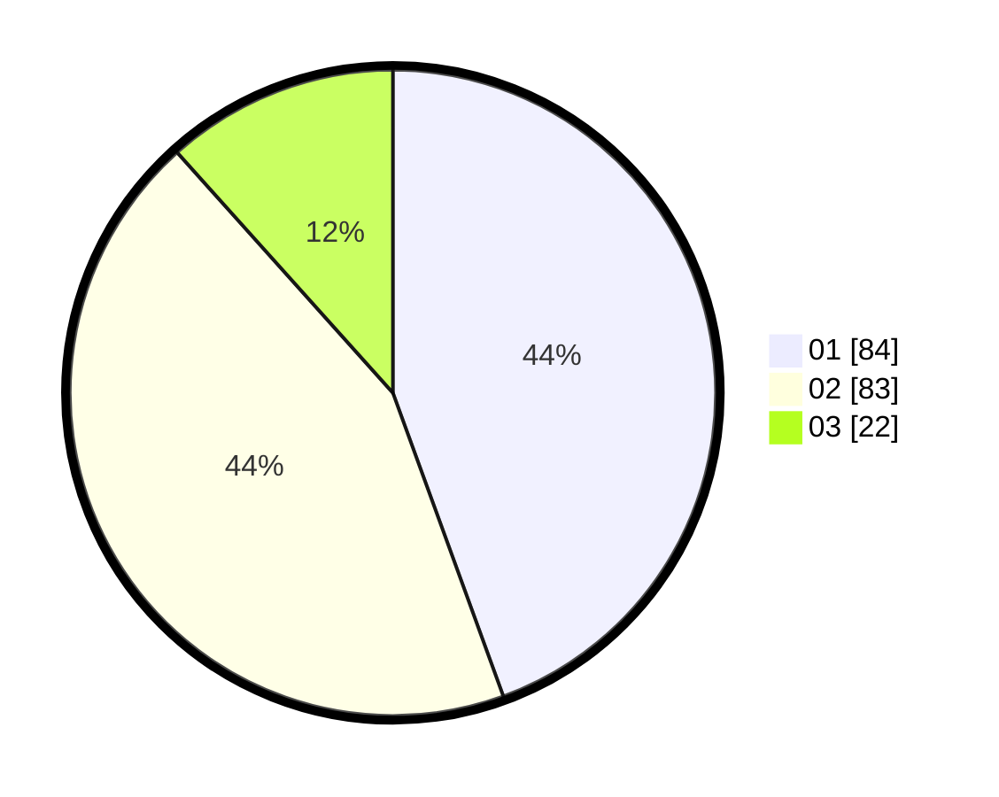

# Hasil

Hasil perolehan suara paslon dapat dilihat pada file paslon-01.txt, paslon-02.txt, dan paslon-03.txt.

Jika tidak ada, artinya data tersebut belum ada pada SIREKAP.

## Perolehan Suara

 * Paslon 01: **84**.
 * Paslon 02: **83**.
 * Paslon 03: **22**.

## Foto C Plano

https://sirekap-obj-formc.kpu.go.id/27db/pemilu/ppwp/31/75/04/10/03/3175041003041-20240214-193524--bed6cd3d-840f-42aa-be9c-b03635c941eb.jpg

https://sirekap-obj-formc.kpu.go.id/27db/pemilu/ppwp/31/75/04/10/03/3175041003041-20240214-193604--744874b3-1e2c-4a18-8135-87395f898a1b.jpg

https://sirekap-obj-formc.kpu.go.id/27db/pemilu/ppwp/31/75/04/10/03/3175041003041-20240214-193650--571b0ea1-4477-48f0-98fc-52e424e0e2bf.jpg

## DATA PEMILIH TETAP

Jumlah pemilih dalam DPT: **254**.
 * L: **121**.
 * P: **133**.

## DATA PENGGUNA HAK PILIH

Jumlah pengguna hak pilih dalam DPT: **184**.
 * L: **86**.
 * P: **98**.

Jumlah pengguna hak pilih dalam DPTb: **8**.
 * L: **5**.
 * P: **3**.

Jumlah pengguna hak pilih dalam DPK: **1**.
 * L: **1**.
 * P: **0**.

Jumlah pengguna hak pilih: **193**.
 * L: **92**.
 * P: **101**.

## JUMLAH SUARA SAH DAN TIDAK SAH

JUMLAH SELURUH SUARA SAH: **190**.

JUMLAH SUARA TIDAK SAH: **3**.

JUMLAH SELURUH SUARA SAH DAN SUARA TIDAK SAH: **193**.
