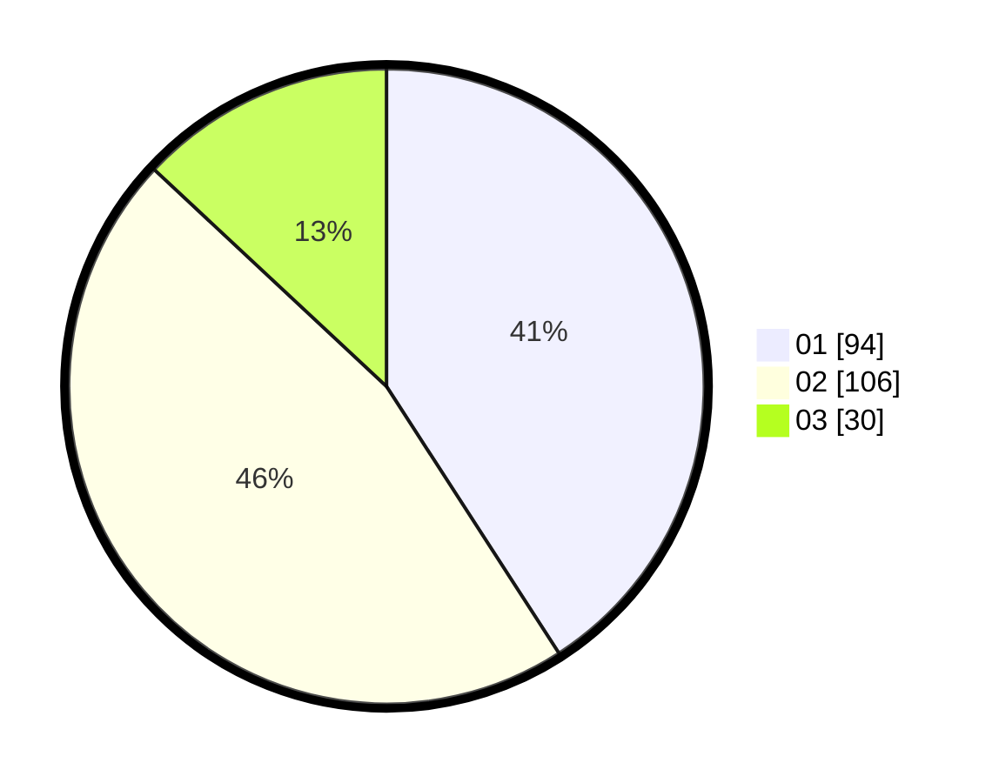

# Hasil

Hasil perolehan suara paslon dapat dilihat pada file paslon-01.txt, paslon-02.txt, dan paslon-03.txt.

Jika tidak ada, artinya data tersebut belum ada pada SIREKAP.

## Perolehan Suara

 * Paslon 01: **94**.
 * Paslon 02: **106**.
 * Paslon 03: **30**.

## Foto C Plano

https://sirekap-obj-formc.kpu.go.id/7604/pemilu/ppwp/31/75/04/10/03/3175041003051-20240214-155710--8a7378f1-ddad-40aa-8e54-3d691d6cb1c6.jpg

https://sirekap-obj-formc.kpu.go.id/7604/pemilu/ppwp/31/75/04/10/03/3175041003051-20240214-193639--54827205-b12d-4ef0-8f0c-b02682269499.jpg

https://sirekap-obj-formc.kpu.go.id/7604/pemilu/ppwp/31/75/04/10/03/3175041003051-20240214-191037--50e7b256-904b-45c1-8947-03e0695ac8fe.jpg

## DATA PEMILIH TETAP

Jumlah pemilih dalam DPT: **289**.
 * L: **141**.
 * P: **148**.

## DATA PENGGUNA HAK PILIH

Jumlah pengguna hak pilih dalam DPT: **215**.
 * L: **97**.
 * P: **118**.

Jumlah pengguna hak pilih dalam DPTb: **6**.
 * L: **2**.
 * P: **4**.

Jumlah pengguna hak pilih dalam DPK: **9**.
 * L: **5**.
 * P: **4**.

Jumlah pengguna hak pilih: **230**.
 * L: **104**.
 * P: **126**.

## JUMLAH SUARA SAH DAN TIDAK SAH

JUMLAH SELURUH SUARA SAH: **230**.

JUMLAH SUARA TIDAK SAH: **0**.

JUMLAH SELURUH SUARA SAH DAN SUARA TIDAK SAH: **230**.
