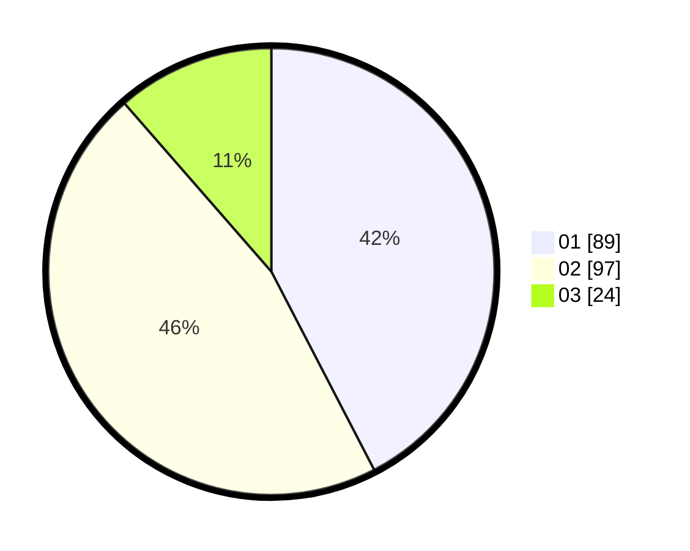

# Hasil

Hasil perolehan suara paslon dapat dilihat pada file paslon-01.txt, paslon-02.txt, dan paslon-03.txt.

Jika tidak ada, artinya data tersebut belum ada pada SIREKAP.

## Perolehan Suara

 * Paslon 01: **89**.
 * Paslon 02: **97**.
 * Paslon 03: **24**.

## Foto C Plano

https://sirekap-obj-formc.kpu.go.id/bdec/pemilu/ppwp/31/75/04/10/03/3175041003053-20240214-201519--c579b997-32e3-47ee-b199-1986f50d4cb3.jpg

https://sirekap-obj-formc.kpu.go.id/bdec/pemilu/ppwp/31/75/04/10/03/3175041003053-20240214-210429--8f07c93c-1df2-4b37-9ba1-6eea29b6e0fc.jpg

https://sirekap-obj-formc.kpu.go.id/bdec/pemilu/ppwp/31/75/04/10/03/3175041003053-20240214-201643--fec5234a-c834-4b57-9cd6-8b04eb7188e2.jpg

## DATA PEMILIH TETAP

Jumlah pemilih dalam DPT: **281**.
 * L: **135**.
 * P: **146**.

## DATA PENGGUNA HAK PILIH

Jumlah pengguna hak pilih dalam DPT: **203**.
 * L: **93**.
 * P: **110**.

Jumlah pengguna hak pilih dalam DPTb: **3**.
 * L: **2**.
 * P: **1**.

Jumlah pengguna hak pilih dalam DPK: **8**.
 * L: **3**.
 * P: **5**.

Jumlah pengguna hak pilih: **214**.
 * L: **98**.
 * P: **116**.

## JUMLAH SUARA SAH DAN TIDAK SAH

JUMLAH SELURUH SUARA SAH: **210**.

JUMLAH SUARA TIDAK SAH: **4**.

JUMLAH SELURUH SUARA SAH DAN SUARA TIDAK SAH: **214**.
