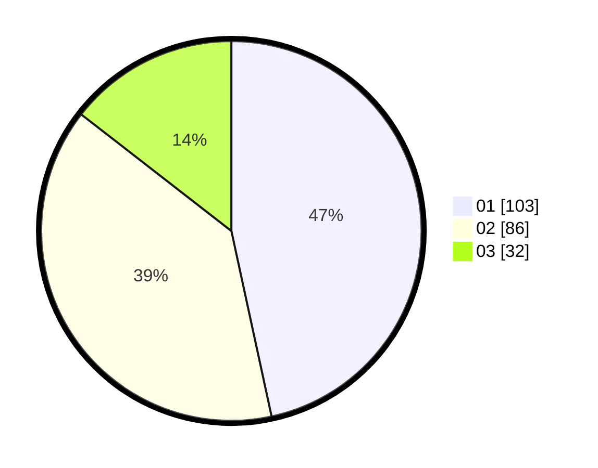

# Hasil

Hasil perolehan suara paslon dapat dilihat pada file paslon-01.txt, paslon-02.txt, dan paslon-03.txt.

Jika tidak ada, artinya data tersebut belum ada pada SIREKAP.

## Perolehan Suara

 * Paslon 01: **103**.
 * Paslon 02: **86**.
 * Paslon 03: **32**.

## Foto C Plano

https://sirekap-obj-formc.kpu.go.id/a467/pemilu/ppwp/31/75/04/10/03/3175041003058-20240214-230711--1d54033f-e6fe-453a-894a-e95cebdc25fa.jpg

https://sirekap-obj-formc.kpu.go.id/a467/pemilu/ppwp/31/75/04/10/03/3175041003058-20240214-230717--7d820d4e-d01e-49dd-95aa-108eefed532b.jpg

https://sirekap-obj-formc.kpu.go.id/a467/pemilu/ppwp/31/75/04/10/03/3175041003058-20240215-161847--358c0601-42d0-4646-a2b8-c6ba297c91dd.jpg

## DATA PEMILIH TETAP

Jumlah pemilih dalam DPT: **262**.
 * L: **136**.
 * P: **126**.

## DATA PENGGUNA HAK PILIH

Jumlah pengguna hak pilih dalam DPT: **219**.
 * L: **113**.
 * P: **106**.

Jumlah pengguna hak pilih dalam DPTb: **3**.
 * L: **2**.
 * P: **1**.

Jumlah pengguna hak pilih dalam DPK: **2**.
 * L: **1**.
 * P: **1**.

Jumlah pengguna hak pilih: **224**.
 * L: **116**.
 * P: **108**.

## JUMLAH SUARA SAH DAN TIDAK SAH

JUMLAH SELURUH SUARA SAH: **221**.

JUMLAH SUARA TIDAK SAH: **3**.

JUMLAH SELURUH SUARA SAH DAN SUARA TIDAK SAH: **224**.
