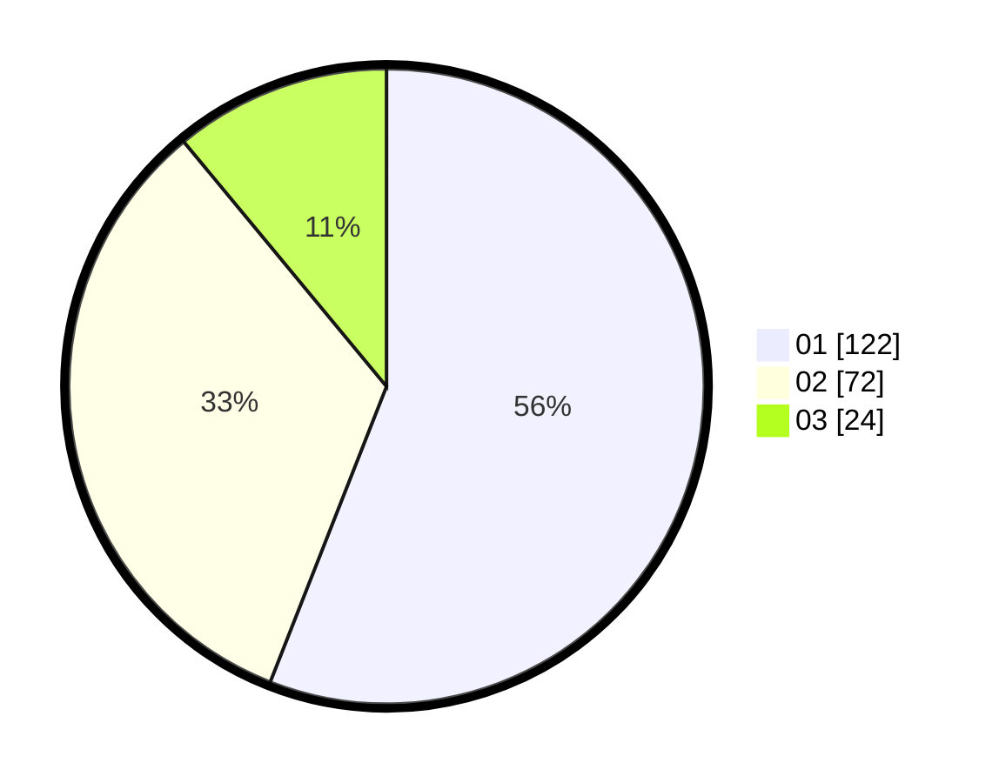

# Hasil

Hasil perolehan suara paslon dapat dilihat pada file paslon-01.txt, paslon-02.txt, dan paslon-03.txt.

Jika tidak ada, artinya data tersebut belum ada pada SIREKAP.

## Perolehan Suara

 * Paslon 01: **122**.
 * Paslon 02: **72**.
 * Paslon 03: **24**.

## Foto C Plano

https://sirekap-obj-formc.kpu.go.id/8322/pemilu/ppwp/31/75/04/10/03/3175041003060-20240214-223757--7446822e-4f28-4463-b2a5-cc8109987cad.jpg

https://sirekap-obj-formc.kpu.go.id/8322/pemilu/ppwp/31/75/04/10/03/3175041003060-20240214-190306--e6ed820f-52c8-45eb-ac78-2187b8db758e.jpg

https://sirekap-obj-formc.kpu.go.id/8322/pemilu/ppwp/31/75/04/10/03/3175041003060-20240214-190849--305f183a-bf6a-4adc-9287-6e6d1b63e05c.jpg

## DATA PEMILIH TETAP

Jumlah pemilih dalam DPT: **257**.
 * L: **127**.
 * P: **130**.

## DATA PENGGUNA HAK PILIH

Jumlah pengguna hak pilih dalam DPT: **213**.
 * L: **102**.
 * P: **111**.

Jumlah pengguna hak pilih dalam DPTb: **2**.
 * L: **2**.
 * P: **0**.

Jumlah pengguna hak pilih dalam DPK: **3**.
 * L: **1**.
 * P: **2**.

Jumlah pengguna hak pilih: **218**.
 * L: **105**.
 * P: **113**.

## JUMLAH SUARA SAH DAN TIDAK SAH

JUMLAH SELURUH SUARA SAH: **218**.

JUMLAH SUARA TIDAK SAH: **0**.

JUMLAH SELURUH SUARA SAH DAN SUARA TIDAK SAH: **218**.
