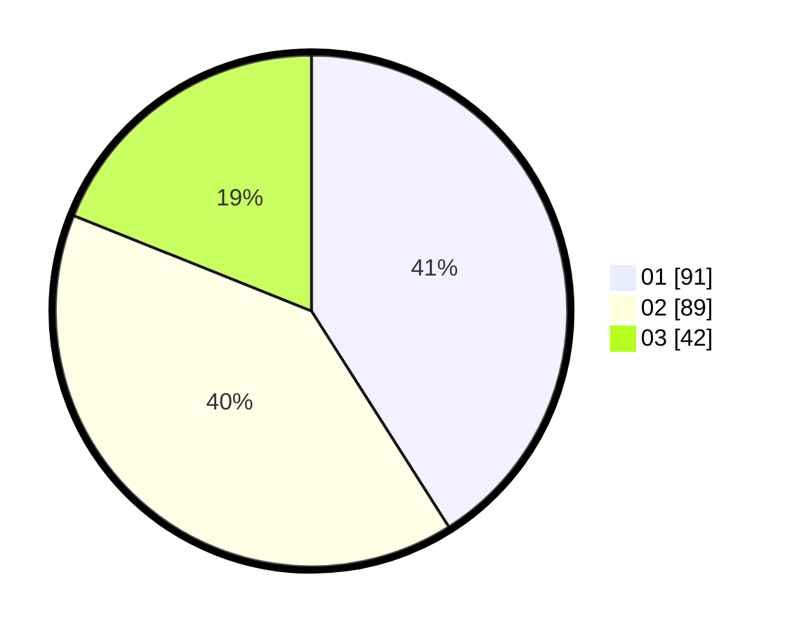

# Hasil

Hasil perolehan suara paslon dapat dilihat pada file paslon-01.txt, paslon-02.txt, dan paslon-03.txt.

Jika tidak ada, artinya data tersebut belum ada pada SIREKAP.

## Perolehan Suara

 * Paslon 01: **91**.
 * Paslon 02: **89**.
 * Paslon 03: **42**.

## Foto C Plano

https://sirekap-obj-formc.kpu.go.id/1c89/pemilu/ppwp/31/75/04/10/03/3175041003074-20240214-155730--84caa1a1-3588-467f-ab5f-df550e37b553.jpg

https://sirekap-obj-formc.kpu.go.id/1c89/pemilu/ppwp/31/75/04/10/03/3175041003074-20240214-155907--a72ab3be-cf0a-4a49-ae0d-bb12f568a13c.jpg

https://sirekap-obj-formc.kpu.go.id/1c89/pemilu/ppwp/31/75/04/10/03/3175041003074-20240214-160115--c995d375-08a2-4bff-9b6e-6f3fcac946c1.jpg
