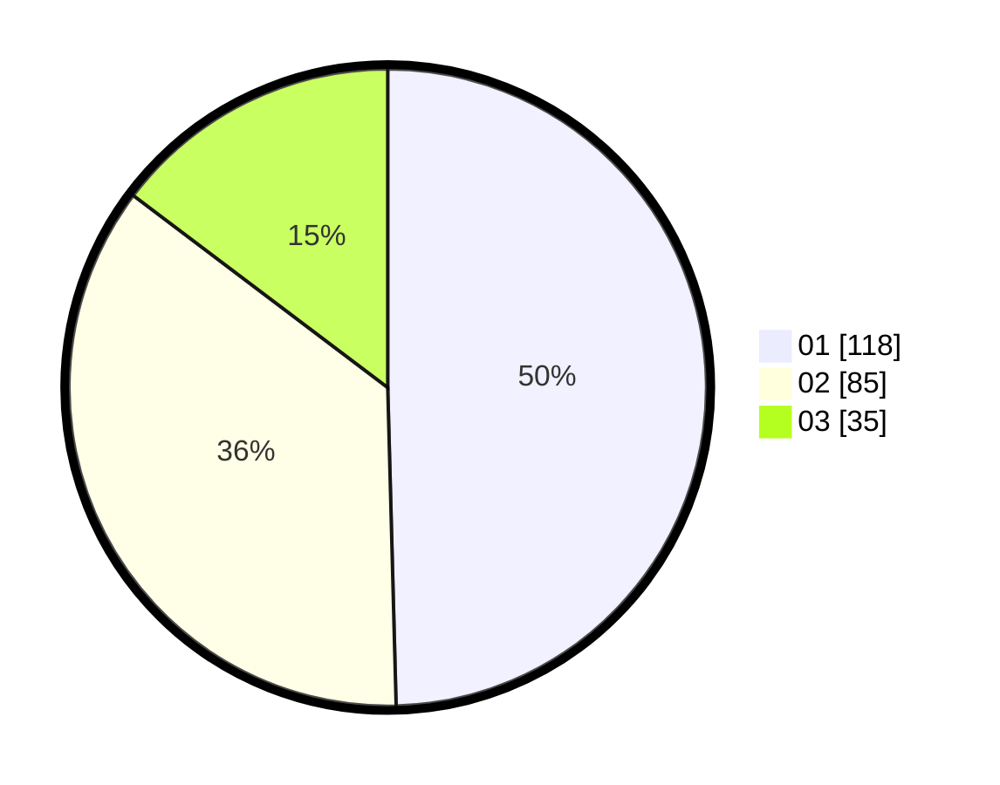

# Hasil

Hasil perolehan suara paslon dapat dilihat pada file paslon-01.txt, paslon-02.txt, dan paslon-03.txt.

Jika tidak ada, artinya data tersebut belum ada pada SIREKAP.

## Perolehan Suara

 * Paslon 01: **118**.
 * Paslon 02: **85**.
 * Paslon 03: **35**.

## Foto C Plano

https://sirekap-obj-formc.kpu.go.id/6b53/pemilu/ppwp/31/75/04/10/03/3175041003077-20240216-154509--c491b49b-ff40-42d1-8e08-f0135ceda663.jpg

https://sirekap-obj-formc.kpu.go.id/6b53/pemilu/ppwp/31/75/04/10/03/3175041003077-20240216-154511--2eaa9ca5-eb22-4697-a444-d0b0a31799f1.jpg

https://sirekap-obj-formc.kpu.go.id/6b53/pemilu/ppwp/31/75/04/10/03/3175041003077-20240216-154510--b7db725b-4a76-4ba7-bd08-6806cd2d7fd1.jpg

## DATA PEMILIH TETAP

Jumlah pemilih dalam DPT: **269**.
 * L: **138**.
 * P: **131**.

## DATA PENGGUNA HAK PILIH

Jumlah pengguna hak pilih dalam DPT: **236**.
 * L: **113**.
 * P: **123**.

Jumlah pengguna hak pilih dalam DPTb: **1**.
 * L: **1**.
 * P: **0**.

Jumlah pengguna hak pilih dalam DPK: **5**.
 * L: **1**.
 * P: **4**.

Jumlah pengguna hak pilih: **242**.
 * L: **115**.
 * P: **127**.

## JUMLAH SUARA SAH DAN TIDAK SAH

JUMLAH SELURUH SUARA SAH: **238**.

JUMLAH SUARA TIDAK SAH: **4**.

JUMLAH SELURUH SUARA SAH DAN SUARA TIDAK SAH: **242**.
