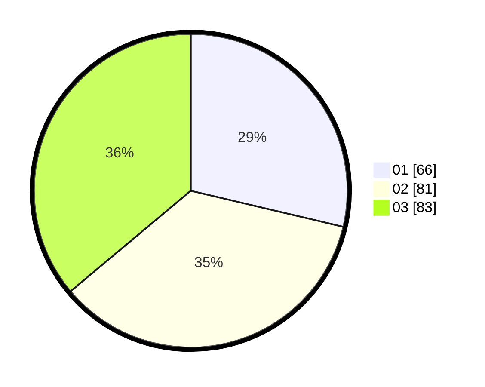

# Hasil

Hasil perolehan suara paslon dapat dilihat pada file paslon-01.txt, paslon-02.txt, dan paslon-03.txt.

Jika tidak ada, artinya data tersebut belum ada pada SIREKAP.

## Perolehan Suara

 * Paslon 01: **66**.
 * Paslon 02: **81**.
 * Paslon 03: **83**.

## Foto C Plano

https://sirekap-obj-formc.kpu.go.id/1da5/pemilu/ppwp/31/75/04/10/03/3175041003083-20240215-032959--9f7aac10-5459-4a40-8cd6-739cc68cc90b.jpg

https://sirekap-obj-formc.kpu.go.id/1da5/pemilu/ppwp/31/75/04/10/03/3175041003083-20240218-134959--9021dc0f-c81d-4146-b22b-cad53dadae75.jpg

https://sirekap-obj-formc.kpu.go.id/1da5/pemilu/ppwp/31/75/04/10/03/3175041003083-20240215-181312--352694f9-7103-4c1b-af5c-0914dddccb32.jpg

## DATA PEMILIH TETAP

Jumlah pemilih dalam DPT: **292**.
 * L: **131**.
 * P: **161**.

## DATA PENGGUNA HAK PILIH

Jumlah pengguna hak pilih dalam DPT: **224**.
 * L: **96**.
 * P: **128**.

Jumlah pengguna hak pilih dalam DPTb: **6**.
 * L: **3**.
 * P: **3**.

Jumlah pengguna hak pilih dalam DPK: **3**.
 * L: **2**.
 * P: **1**.

Jumlah pengguna hak pilih: **233**.
 * L: **101**.
 * P: **132**.

## JUMLAH SUARA SAH DAN TIDAK SAH

JUMLAH SELURUH SUARA SAH: **230**.

JUMLAH SUARA TIDAK SAH: **3**.

JUMLAH SELURUH SUARA SAH DAN SUARA TIDAK SAH: **233**.
