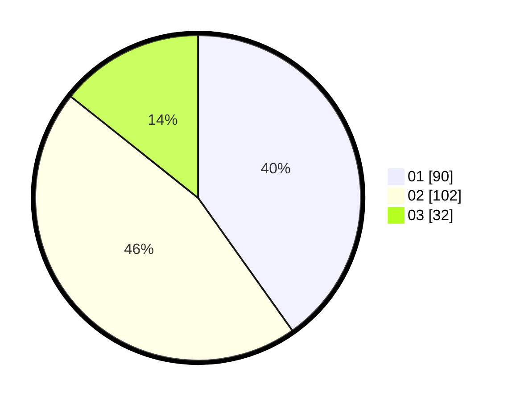

# Hasil

Hasil perolehan suara paslon dapat dilihat pada file paslon-01.txt, paslon-02.txt, dan paslon-03.txt.

Jika tidak ada, artinya data tersebut belum ada pada SIREKAP.

## Perolehan Suara

 * Paslon 01: **90**.
 * Paslon 02: **102**.
 * Paslon 03: **32**.

## Foto C Plano

https://sirekap-obj-formc.kpu.go.id/4d73/pemilu/ppwp/31/75/04/10/04/3175041004009-20240214-213350--af22ddf1-5a98-4264-a50f-ecbdcf23b394.jpg

https://sirekap-obj-formc.kpu.go.id/4d73/pemilu/ppwp/31/75/04/10/04/3175041004009-20240214-211023--19afd652-e7ad-4e0f-92c0-e83b77fde2b4.jpg

https://sirekap-obj-formc.kpu.go.id/4d73/pemilu/ppwp/31/75/04/10/04/3175041004009-20240214-211240--739361bf-d93b-4b42-ba4d-407fc6bb9744.jpg
