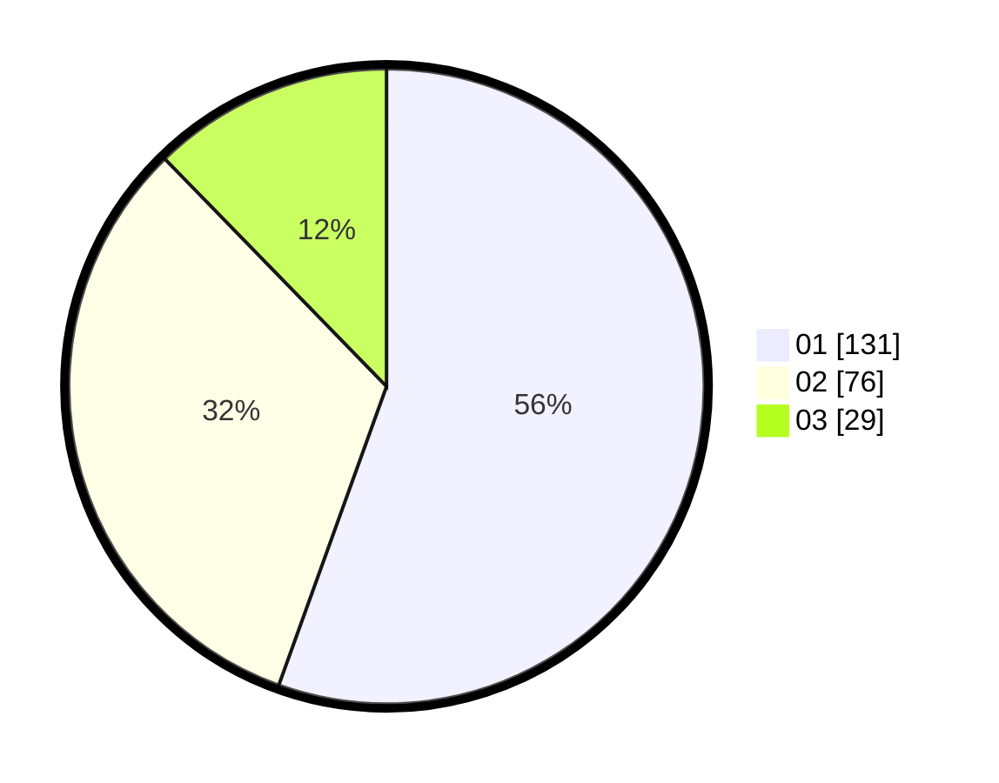

# Hasil

Hasil perolehan suara paslon dapat dilihat pada file paslon-01.txt, paslon-02.txt, dan paslon-03.txt.

Jika tidak ada, artinya data tersebut belum ada pada SIREKAP.

## Perolehan Suara

 * Paslon 01: **131**.
 * Paslon 02: **76**.
 * Paslon 03: **29**.

## Foto C Plano

https://sirekap-obj-formc.kpu.go.id/6fbd/pemilu/ppwp/31/75/04/10/04/3175041004011-20240215-005145--5f57e4e2-ea09-4121-9e48-38cf475824eb.jpg

https://sirekap-obj-formc.kpu.go.id/6fbd/pemilu/ppwp/31/75/04/10/04/3175041004011-20240215-005402--58e89fe3-1473-4e3e-a37f-678659f8c949.jpg

https://sirekap-obj-formc.kpu.go.id/6fbd/pemilu/ppwp/31/75/04/10/04/3175041004011-20240215-005644--eac2b64e-b112-47c7-8d32-4a7decfc213c.jpg
