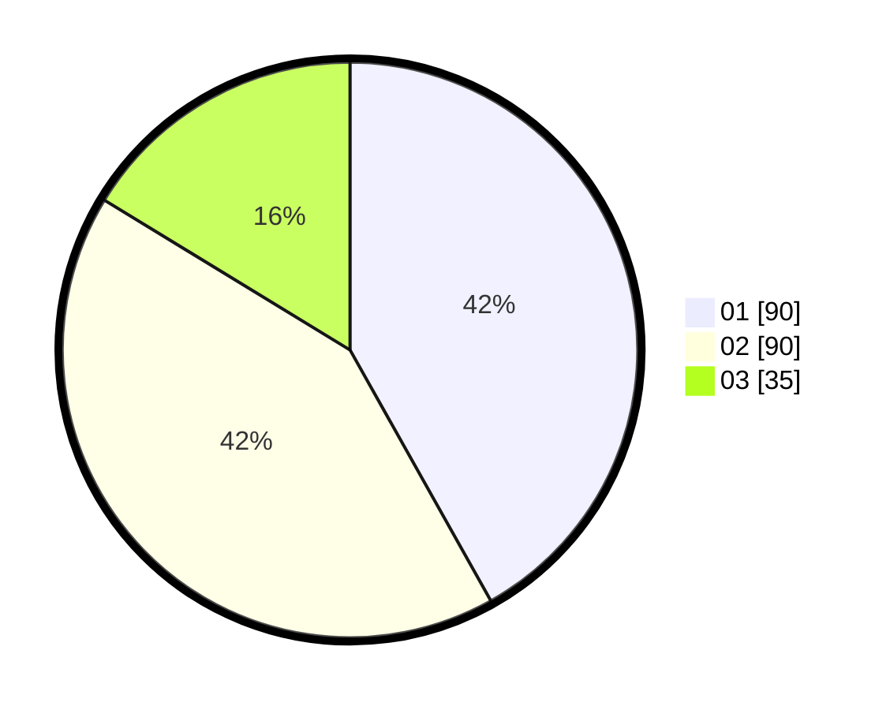

# Hasil

Hasil perolehan suara paslon dapat dilihat pada file paslon-01.txt, paslon-02.txt, dan paslon-03.txt.

Jika tidak ada, artinya data tersebut belum ada pada SIREKAP.

## Perolehan Suara

 * Paslon 01: **90**.
 * Paslon 02: **90**.
 * Paslon 03: **35**.

## Foto C Plano

https://sirekap-obj-formc.kpu.go.id/df7c/pemilu/ppwp/31/75/04/10/04/3175041004014-20240215-074133--d37fe1a9-0a01-402b-ac1f-87d3cd9610a8.jpg

https://sirekap-obj-formc.kpu.go.id/df7c/pemilu/ppwp/31/75/04/10/04/3175041004014-20240215-074230--5a3266a1-c028-4cb4-ac68-491ec70e05c2.jpg

https://sirekap-obj-formc.kpu.go.id/df7c/pemilu/ppwp/31/75/04/10/04/3175041004014-20240215-074312--da91ba54-4bc1-4dd7-92f7-4cc0cc0ac471.jpg
