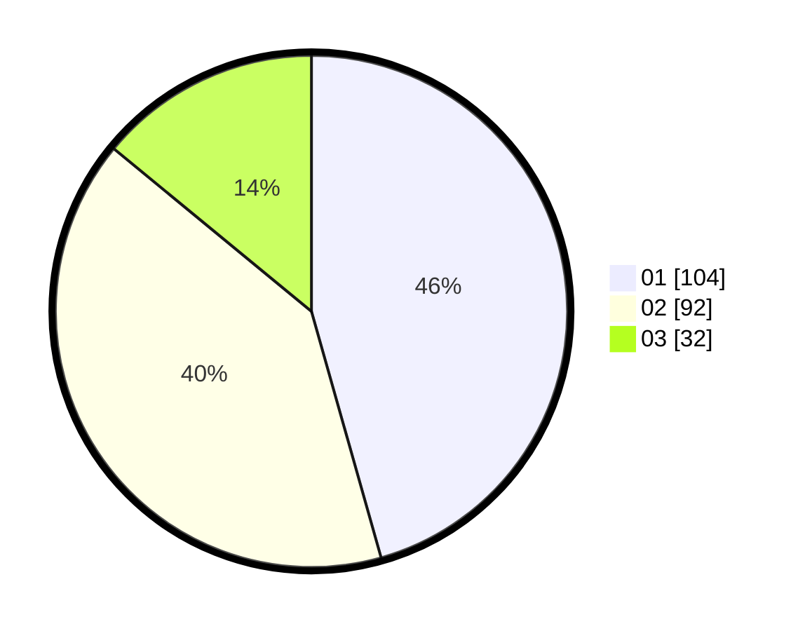

# Hasil

Hasil perolehan suara paslon dapat dilihat pada file paslon-01.txt, paslon-02.txt, dan paslon-03.txt.

Jika tidak ada, artinya data tersebut belum ada pada SIREKAP.

## Perolehan Suara

 * Paslon 01: **104**.
 * Paslon 02: **92**.
 * Paslon 03: **32**.

## Foto C Plano

https://sirekap-obj-formc.kpu.go.id/3830/pemilu/ppwp/31/75/04/10/04/3175041004020-20240214-233604--8c527ca5-329f-4084-898e-fe14fb74aabb.jpg

https://sirekap-obj-formc.kpu.go.id/3830/pemilu/ppwp/31/75/04/10/04/3175041004020-20240214-233702--52158797-13dd-4552-bfb4-54af72907f8e.jpg

https://sirekap-obj-formc.kpu.go.id/3830/pemilu/ppwp/31/75/04/10/04/3175041004020-20240214-233746--6fbb5987-5695-49fb-9853-84c955e6f9b5.jpg
