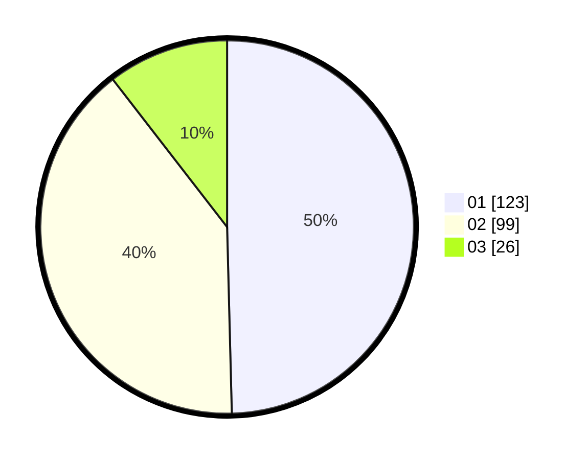

# Hasil

Hasil perolehan suara paslon dapat dilihat pada file paslon-01.txt, paslon-02.txt, dan paslon-03.txt.

Jika tidak ada, artinya data tersebut belum ada pada SIREKAP.

## Perolehan Suara

 * Paslon 01: **123**.
 * Paslon 02: **99**.
 * Paslon 03: **26**.

## Foto C Plano

https://sirekap-obj-formc.kpu.go.id/f363/pemilu/ppwp/31/75/04/10/04/3175041004023-20240214-235106--64042638-d04e-4fea-b607-b72a69b9f22b.jpg

https://sirekap-obj-formc.kpu.go.id/f363/pemilu/ppwp/31/75/04/10/04/3175041004023-20240214-193947--77807dd3-350d-4afe-a048-c5fb4372ea2d.jpg

https://sirekap-obj-formc.kpu.go.id/f363/pemilu/ppwp/31/75/04/10/04/3175041004023-20240214-194003--6d8c8d3e-7e2b-43d5-a188-ad7461393c2e.jpg
