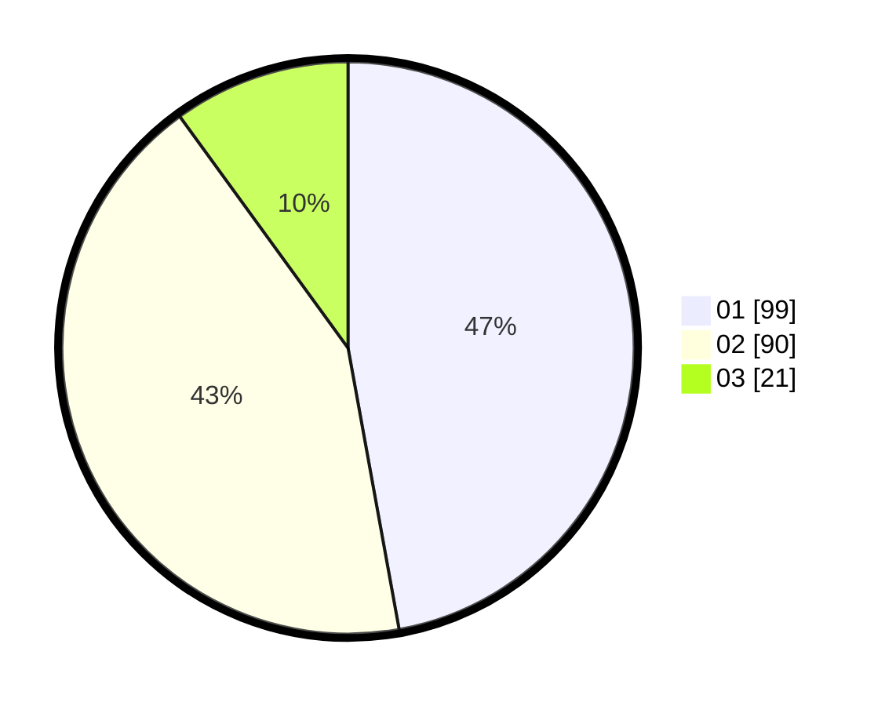

# Hasil

Hasil perolehan suara paslon dapat dilihat pada file paslon-01.txt, paslon-02.txt, dan paslon-03.txt.

Jika tidak ada, artinya data tersebut belum ada pada SIREKAP.

## Perolehan Suara

 * Paslon 01: **99**.
 * Paslon 02: **90**.
 * Paslon 03: **21**.

## Foto C Plano

https://sirekap-obj-formc.kpu.go.id/063d/pemilu/ppwp/31/75/04/10/04/3175041004027-20240214-204704--13ca00da-abd1-43a8-9fd8-58db675f8be4.jpg

https://sirekap-obj-formc.kpu.go.id/063d/pemilu/ppwp/31/75/04/10/04/3175041004027-20240214-204758--d9d5d1da-1c22-421c-82e6-e89b690a0996.jpg

https://sirekap-obj-formc.kpu.go.id/063d/pemilu/ppwp/31/75/04/10/04/3175041004027-20240214-204837--dcd02e00-e1a2-4539-a911-04f87ee6cdfe.jpg
