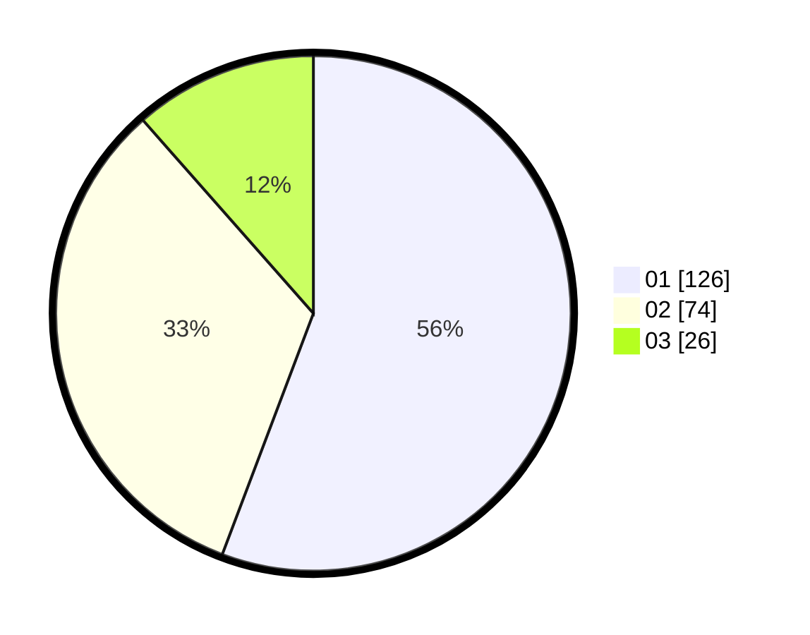

# Hasil

Hasil perolehan suara paslon dapat dilihat pada file paslon-01.txt, paslon-02.txt, dan paslon-03.txt.

Jika tidak ada, artinya data tersebut belum ada pada SIREKAP.

## Perolehan Suara

 * Paslon 01: **126**.
 * Paslon 02: **74**.
 * Paslon 03: **26**.

## Foto C Plano

https://sirekap-obj-formc.kpu.go.id/1928/pemilu/ppwp/31/75/04/10/04/3175041004031-20240214-205946--33374f14-08a3-4258-8a73-97e0a51ff20a.jpg

https://sirekap-obj-formc.kpu.go.id/1928/pemilu/ppwp/31/75/04/10/04/3175041004031-20240214-210106--b4862aca-409a-481e-9e16-4c2cfd52cf49.jpg
