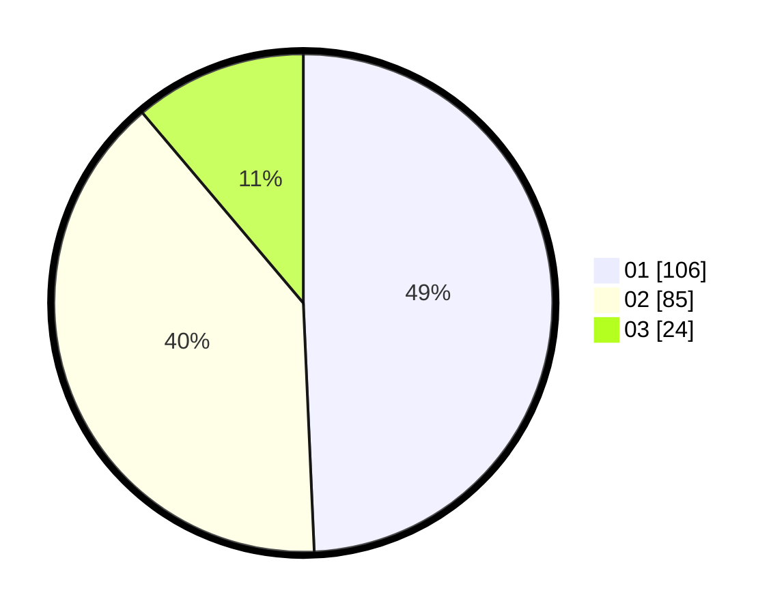

# Hasil

Hasil perolehan suara paslon dapat dilihat pada file paslon-01.txt, paslon-02.txt, dan paslon-03.txt.

Jika tidak ada, artinya data tersebut belum ada pada SIREKAP.

## Perolehan Suara

 * Paslon 01: **106**.
 * Paslon 02: **85**.
 * Paslon 03: **24**.

## Foto C Plano

https://sirekap-obj-formc.kpu.go.id/165f/pemilu/ppwp/31/75/04/10/04/3175041004035-20240215-105701--0387d470-15a5-44d7-ab4a-120943b31d8b.jpg

https://sirekap-obj-formc.kpu.go.id/165f/pemilu/ppwp/31/75/04/10/04/3175041004035-20240215-105857--0b452a75-967b-4e92-89f0-b50d9f60e4d1.jpg
