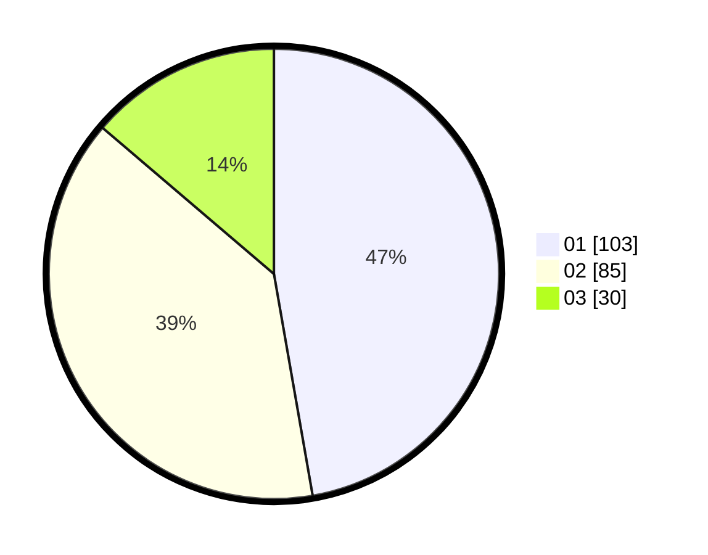

# Hasil

Hasil perolehan suara paslon dapat dilihat pada file paslon-01.txt, paslon-02.txt, dan paslon-03.txt.

Jika tidak ada, artinya data tersebut belum ada pada SIREKAP.

## Perolehan Suara

 * Paslon 01: **103**.
 * Paslon 02: **85**.
 * Paslon 03: **30**.

## Foto C Plano

https://sirekap-obj-formc.kpu.go.id/9b6b/pemilu/ppwp/31/75/04/10/04/3175041004036-20240214-190514--bcc8a0a4-e04e-41d8-9e07-46cb6103c971.jpg

https://sirekap-obj-formc.kpu.go.id/9b6b/pemilu/ppwp/31/75/04/10/04/3175041004036-20240214-193204--dafb53c1-675e-4ee4-9027-4dddc0163909.jpg
