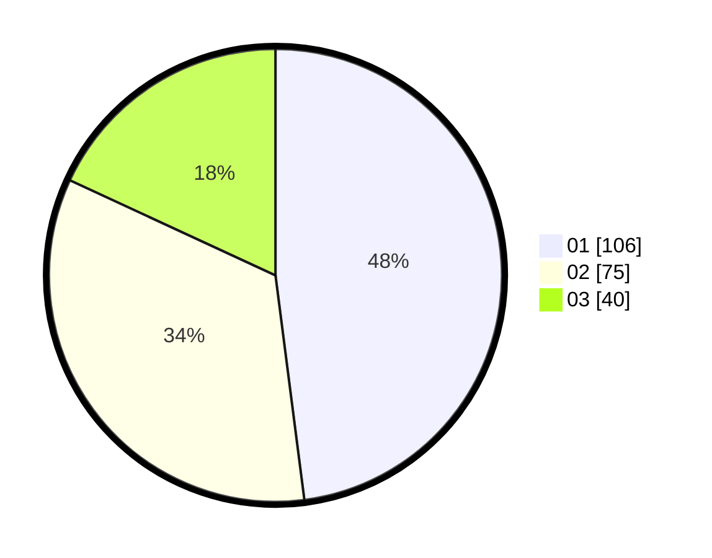

# Hasil

Hasil perolehan suara paslon dapat dilihat pada file paslon-01.txt, paslon-02.txt, dan paslon-03.txt.

Jika tidak ada, artinya data tersebut belum ada pada SIREKAP.

## Perolehan Suara

 * Paslon 01: **106**.
 * Paslon 02: **75**.
 * Paslon 03: **40**.

## Foto C Plano

https://sirekap-obj-formc.kpu.go.id/2c64/pemilu/ppwp/31/75/04/10/04/3175041004037-20240214-231915--9a281151-f1cd-4946-8dd1-a1662684d345.jpg

https://sirekap-obj-formc.kpu.go.id/2c64/pemilu/ppwp/31/75/04/10/04/3175041004037-20240214-232219--39404b93-3ce9-403d-81d7-11e3d3dd8b25.jpg

https://sirekap-obj-formc.kpu.go.id/2c64/pemilu/ppwp/31/75/04/10/04/3175041004037-20240214-232322--9a074ede-557c-42ae-b613-0243a0bf4853.jpg
