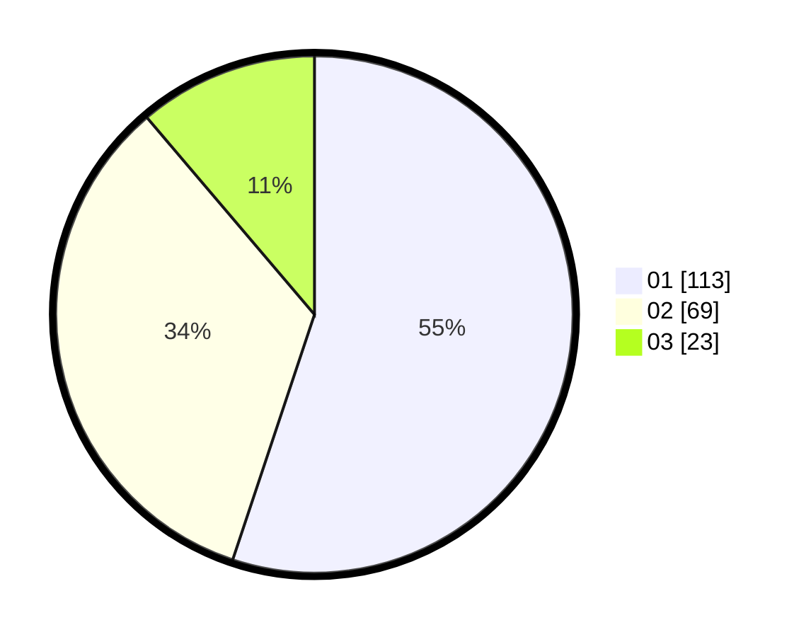

# Hasil

Hasil perolehan suara paslon dapat dilihat pada file paslon-01.txt, paslon-02.txt, dan paslon-03.txt.

Jika tidak ada, artinya data tersebut belum ada pada SIREKAP.

## Perolehan Suara

 * Paslon 01: **113**.
 * Paslon 02: **69**.
 * Paslon 03: **23**.

## Foto C Plano

https://sirekap-obj-formc.kpu.go.id/908d/pemilu/ppwp/31/75/04/10/04/3175041004044-20240214-204829--7bd031f2-22ca-4245-b38f-79b5d2677c4f.jpg

https://sirekap-obj-formc.kpu.go.id/908d/pemilu/ppwp/31/75/04/10/04/3175041004044-20240214-204854--677a0981-751f-4319-8a6e-28f193fb31ec.jpg

https://sirekap-obj-formc.kpu.go.id/908d/pemilu/ppwp/31/75/04/10/04/3175041004044-20240214-204917--bed32e43-cd45-4b66-b116-44574282d8b8.jpg

## DATA PEMILIH TETAP

Jumlah pemilih dalam DPT: **264**.
 * L: **135**.
 * P: **129**.

## DATA PENGGUNA HAK PILIH

Jumlah pengguna hak pilih dalam DPT: **191**.
 * L: **91**.
 * P: **100**.

Jumlah pengguna hak pilih dalam DPTb: **14**.
 * L: **10**.
 * P: **4**.

Jumlah pengguna hak pilih dalam DPK: **5**.
 * L: **4**.
 * P: **1**.

Jumlah pengguna hak pilih: **210**.
 * L: **105**.
 * P: **105**.

## JUMLAH SUARA SAH DAN TIDAK SAH

JUMLAH SELURUH SUARA SAH: **205**.

JUMLAH SUARA TIDAK SAH: **5**.

JUMLAH SELURUH SUARA SAH DAN SUARA TIDAK SAH: **210**.
