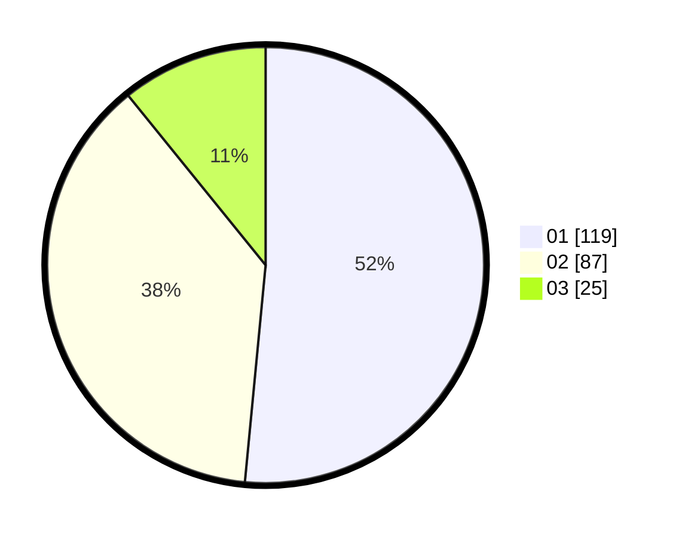

# Hasil

Hasil perolehan suara paslon dapat dilihat pada file paslon-01.txt, paslon-02.txt, dan paslon-03.txt.

Jika tidak ada, artinya data tersebut belum ada pada SIREKAP.

## Perolehan Suara

 * Paslon 01: **119**.
 * Paslon 02: **87**.
 * Paslon 03: **25**.

## Foto C Plano

https://sirekap-obj-formc.kpu.go.id/572a/pemilu/ppwp/31/75/04/10/04/3175041004046-20240214-201705--4fb16f5f-7247-4e8a-a902-04399afbf603.jpg

https://sirekap-obj-formc.kpu.go.id/572a/pemilu/ppwp/31/75/04/10/04/3175041004046-20240214-201748--68174423-2c35-4b79-9687-67363de3413a.jpg

https://sirekap-obj-formc.kpu.go.id/572a/pemilu/ppwp/31/75/04/10/04/3175041004046-20240214-201819--4b7ba65a-f0fb-4d4d-b4f9-312502788dc4.jpg

## DATA PEMILIH TETAP

Jumlah pemilih dalam DPT: **270**.
 * L: **137**.
 * P: **133**.

## DATA PENGGUNA HAK PILIH

Jumlah pengguna hak pilih dalam DPT: **229**.
 * L: **113**.
 * P: **116**.

Jumlah pengguna hak pilih dalam DPTb: **1**.
 * L: **0**.
 * P: **1**.

Jumlah pengguna hak pilih dalam DPK: **703**.
 * L: **0**.
 * P: **3**.

Jumlah pengguna hak pilih: **233**.
 * L: **113**.
 * P: **120**.

## JUMLAH SUARA SAH DAN TIDAK SAH

JUMLAH SELURUH SUARA SAH: **231**.

JUMLAH SUARA TIDAK SAH: **2**.

JUMLAH SELURUH SUARA SAH DAN SUARA TIDAK SAH: **233**.
